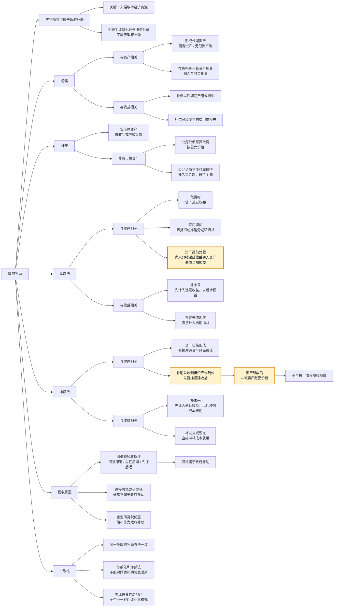

# 政府补助知识点

## 一、个税手续费返还为什么不属于政府补助

### 核心结论

因代扣代缴个人所得税所收到的手续费返还，不属于政府补助。

原因在于：它虽然来自税务机关，但不是政府无偿给予企业的经济资源，而是企业履行代扣代缴义务后取得的手续费性质收入，具有服务对价性质。

### 判断逻辑

政府补助的关键特征是“无偿性”。

也就是说，企业从政府取得经济资源时，如果不需要向政府提供商品、服务或其他对价，才符合政府补助的基本特征。

个税手续费返还的实质是：

1. 企业作为扣缴义务人，代税务机关履行个人所得税代扣代缴工作；
2. 税务机关按照规定向企业返还一定比例的手续费；
3. 该款项是对企业代扣代缴服务的补偿，具有对价性质；
4. 因此不符合政府补助“无偿取得”的特征。

### 易错点

不要因为款项来自税务机关，就直接判断为政府补助。

会计判断看的是经济实质，而不是付款方身份。来自政府或政府部门的款项，只有在符合“无偿性”等条件时，才属于政府补助。

### 会计处理提示

个税手续费返还通常计入“其他收益”。

但需要注意：

计入“其他收益”不等于一定属于政府补助。“其他收益”中也可能核算与日常活动相关、但不属于政府补助的项目。

### 记忆口诀

来自政府不一定是政府补助，关键看是否无偿。

个税手续费返还是代扣代缴服务的对价，所以不是政府补助。

## 二、增值税和企业所得税税收优惠是否属于政府补助

### 核心结论

在增值税和企业所得税税收优惠中，通常只有增值税的“税收返还”类优惠属于政府补助，例如：

1. 增值税即征即退；
2. 增值税先征后退；
3. 增值税先征后返。

企业所得税优惠一般不作为政府补助处理，而是适用所得税相关准则。

### 判断逻辑

判断税收优惠是否属于政府补助，重点看是否存在政府向企业转移资产。

如果企业先缴纳税款，之后政府再将税款返还给企业，企业取得了来自政府的经济资源，通常符合政府补助的特征。

如果只是直接少缴税，例如减税、免税、优惠税率、加计扣除、税额抵免等，企业并没有从政府无偿取得资产，通常不属于政府补助。

### 常见情形

| 税收优惠类型 | 是否属于政府补助 | 理由 |
| --- | --- | --- |
| 增值税即征即退 | 是 | 先缴税，后退税，有政府向企业返还税款 |
| 增值税先征后退 | 是 | 属于税收返还，有资产流入 |
| 增值税先征后返 | 是 | 属于税收返还，有资产流入 |
| 增值税直接减免 | 否 | 只是少缴税，没有政府向企业转移资产 |
| 增值税出口退税 | 否 | 退还的是前道环节负担的进项税，不是政府补助 |
| 企业所得税减免 | 否 | 属于所得税优惠，适用所得税准则 |
| 企业所得税优惠税率 | 否 | 影响所得税费用和应交所得税，不按政府补助处理 |
| 企业所得税加计扣除 | 否 | 属于税前扣除优惠，不是政府补助 |
| 企业所得税税额抵免 | 否 | 属于所得税优惠，不是政府补助 |

### 易错点

不要把所有税收优惠都判断为政府补助。

政府补助强调“从政府无偿取得资产”。税收优惠中，只有税收返还类项目更容易满足这一特征；直接减免、优惠税率、加计扣除等只是减少纳税义务，并没有形成政府向企业转移资产。

### 记忆口诀

增值税“退回来”的，通常可能是政府补助。

所得税“少交的”，一般不是政府补助。

## 三、与资产相关和与收益相关政府补助的划分

### 核心结论

只有形成长期资产的政府补助，才属于与资产相关的政府补助。

与存货相关的政府补助，不属于与资产相关的政府补助，而是属于与收益相关的政府补助。

### 判断逻辑

这里的“资产相关”，重点不是看会计上是不是资产，而是看补助是否用于购建或形成长期资产。

如果政府补助用于购买固定资产、建造厂房、形成无形资产等，相关资产会在较长期间内为企业带来经济利益，因此属于与资产相关的政府补助。

如果政府补助与存货相关，例如补贴原材料采购、生产成本或库存商品，虽然存货也是资产，但存货通常会通过销售转入成本，并最终影响损益。因此，与存货相关的政府补助按与收益相关的政府补助处理。

### 常见情形

| 补助用途 | 分类 | 理由 |
| --- | --- | --- |
| 补助购买机器设备 | 与资产相关 | 形成固定资产，属于长期资产 |
| 补助建造厂房 | 与资产相关 | 形成固定资产，属于长期资产 |
| 补助研发形成无形资产 | 与资产相关 | 形成无形资产，属于长期资产 |
| 补助购买原材料 | 与收益相关 | 与存货相关，最终影响成本和损益 |
| 补助生产某类产品 | 与收益相关 | 与生产成本、存货相关 |
| 补助库存商品成本 | 与收益相关 | 存货最终通过销售结转损益 |
| 补偿已发生费用或损失 | 与收益相关 | 直接与损益相关 |

### 易错点

不要看到“存货是资产”，就把与存货相关的补助判断为与资产相关的政府补助。

准则中的与资产相关政府补助，强调的是形成长期资产。存货虽然属于资产，但不是长期资产，所以与存货相关的补助归入与收益相关的政府补助。

### 记忆口诀

长期资产才算资产相关。

存货相关，归收益相关。

## 四、政府补助是否必须实际收到才确认，以及非货币性资产如何计量

### 核心结论

政府补助不一定要实际收到后才可以确认和计量。

只要企业能够满足政府补助所附条件，并且能够收到政府补助，就可以确认政府补助。也就是说，如果补助已经获批、企业符合条件、收款不存在重大不确定性，即使款项尚未到账，也可以确认相关应收款项和政府补助。

如果政府补助为非货币性资产，应当按照公允价值计量；公允价值不能可靠取得的，按照名义金额计量。

### 判断逻辑

政府补助的确认重点看两个条件：

1. 企业能够满足政府补助所附条件；
2. 企业能够收到政府补助。

因此，判断重点不是“是否已经实际收到”，而是“是否符合条件且能够收到”。

对于非货币性资产形式的政府补助，计量顺序是：

1. 公允价值能够可靠取得的，按照公允价值计量；
2. 公允价值不能可靠取得的，按照名义金额计量。

这里的名义金额通常可以理解为 1 元。

### 举例

政府无偿划拨一台设备给企业。

如果该设备公允价值能够可靠取得，公允价值为 100 万元，则按照 100 万元确认固定资产和政府补助。

如果该设备公允价值不能可靠取得，则按照名义金额确认，通常按 1 元处理。

### 例题：政府无偿提供土地使用权

2X25 年 4 月 1 日，甲公司收到当地政府无偿提供的一块土地使用权，并完成相关手续。该土地使用权的公允价值为 10 000 万元，预计使用寿命为 50 年，采用直线法摊销，预计净残值为零。

甲公司为在该土地上建造办公楼支付土地整理费用 500 万元。甲公司采用总额法对该政府补助进行会计处理。

#### 正确处理

收到土地使用权时，土地使用权属于非货币性资产，且公允价值能够可靠取得，因此应按公允价值 10 000 万元确认无形资产，同时确认递延收益。

```text
借：无形资产        10 000
  贷：递延收益      10 000
```

支付土地整理费用时，该支出是为建造办公楼发生的必要支出，应计入在建工程，而不是管理费用。

```text
借：在建工程           500
  贷：银行存款         500
```

2X25 年应确认的其他收益：

```text
10 000 / 50 * 9 / 12 = 150（万元）
```

```text
借：递延收益           150
  贷：其他收益         150
```

2X25 年应计提土地使用权摊销：

```text
10 000 / 50 * 9 / 12 = 150（万元）
```

```text
借：在建工程 / 管理费用  150
  贷：累计摊销           150
```

如果该土地使用权用于建造办公楼，建造期间的摊销通常计入在建工程；办公楼达到预定可使用状态后，再根据用途计入相关成本费用。

#### 本题易错点

1. 无偿取得土地使用权，不是直接确认其他收益，而是先确认无形资产和递延收益；
2. 采用总额法时，递延收益应在土地使用权使用寿命内分期转入损益；
3. 土地整理费用是建造办公楼的相关支出，应计入在建工程，不是管理费用；
4. 本题从 4 月 1 日取得土地使用权，2X25 年只摊销 9 个月。

### 易错点

不要机械理解为“钱到账了才确认政府补助”。

政府补助能否确认，关键看是否满足确认条件；实际收到只是很强的证据，但不是唯一条件。

也不要把非货币性资产一律按 1 元入账。只有在公允价值不能可靠取得时，才使用名义金额。

### 记忆口诀

补助确认看条件，不是只看到账。

非货币资产能公允就公允，不能公允才 1 元。

## 五、同类会计处理方法要保持一致：政府补助与投资性房地产的类比

### 核心结论

企业对同一类政府补助只能采用同一种会计处理方法，不得对同类补助随意选择不同方法。

类似地，企业对投资性房地产的后续计量也不能对不同房产分别采用成本模式和公允价值模式。投资性房地产的后续计量模式是企业层面的会计政策选择，应当统一适用。

### 政府补助的处理一致性

对于同一类政府补助，企业应当采用一致的会计处理方法。

例如，企业对某一类与收益相关的政府补助，如果选择总额法，就应当对同类补助一致采用总额法；如果选择净额法，也应当对同类补助一致采用净额法。

不能对同一类政府补助，有的采用总额法，有的采用净额法。

### 投资性房地产的类比理解

投资性房地产的后续计量模式只能在企业层面选择一种：

1. 成本模式；
2. 公允价值模式。

企业不能对甲投资性房地产采用成本模式，对乙投资性房地产采用公允价值模式。

如果企业已经对投资性房地产采用公允价值模式，通常不得再转为成本模式。

### 易错点

不要把“具体资产不同”误解为“可以分别选择不同计量模式”。

投资性房地产的后续计量模式是会计政策选择，强调一致性，不是每项资产单独自由选择。

### 记忆口诀

政府补助同类一致。

投资性房地产全企业一种模式，公允能上不能下。

## 六、与资产相关政府补助：资产处置时尚未分摊递延收益的处理

### 核心结论

采用总额法核算与资产相关的政府补助时，如果相关资产在使用寿命结束前被处置，例如出售、报废、转让或发生毁损，尚未分摊的递延收益余额不再继续递延。

<mark>**尚未分摊的递延收益余额，应当转入资产处置当期损益。**</mark>

### 判断逻辑

递延收益原本是随着相关资产的使用，在资产使用寿命内分期计入损益。

如果相关资产已经处置，说明该资产不再继续为企业带来未来经济利益，也就没有后续期间可以继续配比递延收益。

因此，剩余未分摊的递延收益应在资产处置当期一次性转入损益。

### 记忆口诀

资产没了，递延收益也不能再递延。

尚未分摊的余额，转入资产处置当期损益。

## 七、政府补助会计处理思维导图



### 思维导图记忆主线

先判断是不是政府补助，再区分与资产相关还是与收益相关，最后选择总额法或净额法。

总额法的核心是：先确认递延收益，再按规则转损益。

净额法的核心是：冲减相关资产账面价值或相关成本费用；如果与资产相关的补助先收到、资产还没形成，可以先暂挂递延收益，等资产形成后再冲减资产账面价值。

## 八、政府补助退回：净额法下为什么借记其他收益

### 核心结论

采用净额法核算与资产相关的政府补助时，如果以后发生政府补助退回，应当视同一开始就没有收到该政府补助，调整相关资产的账面价值。

如果实际退回金额与资产账面价值调整数之间存在差额，该差额计入当期损益。教材分录中，该差额借记“其他收益”，而不是借记资产折旧对应的费用科目。

### 判断逻辑

净额法下，企业最初收到与资产相关的政府补助时，是直接冲减相关资产成本。

这样会产生两个影响：

1. 固定资产原值较低；
2. 后续计提的折旧也较少。

如果以后政府补助需要退回，就要假设当初没有收到该政府补助。因此，需要把资产成本调回去，同时把以前少计提的累计折旧补上。

补助退回形成的损益影响，性质上仍然属于政府补助事项的调整，不是本期正常使用资产产生的折旧费用。因此，差额计入“其他收益”的借方，用来冲减政府补助相关收益。

### 例题理解

企业退回政府补助款 2 100 000 元。采用净额法处理时，假设以前因冲减资产成本而少计提累计折旧 210 000 元。

退回补助时：

```text
借：固定资产      2 100 000
借：其他收益        210 000
  贷：银行存款    2 100 000
  贷：累计折旧      210 000
```

其中：

```text
资产账面价值调整数 = 固定资产增加额 - 累计折旧增加额
                  = 2 100 000 - 210 000
                  = 1 890 000
```

实际退回现金为 2 100 000 元，超过资产账面价值调整数的 210 000 元，计入当期损益，借记“其他收益”。

### 为什么不是折旧费用

折旧费用反映的是资产在本期正常使用过程中发生的消耗。

这里的 210 000 元不是本期正常使用资产产生的折旧，而是政府补助退回导致的当期损益影响。因此，教材将其作为政府补助事项的调整，计入“其他收益”借方。

### 记忆口诀

累计折旧负责把资产账调正确。

其他收益负责反映退补助的损益影响。

## 九、政府补助退回中的“当期损益”是否一定是其他收益

### 核心结论

不一定。

教材中说“计入当期损益”，是结果层面的表述，意思是影响当期利润表项目，并不等于一定只能使用“其他收益”科目。

“其他收益”是政府补助相关损益中非常常见的科目，但“当期损益”本身是更大的概念。

### 常见科目理解

| 情况 | 当期损益通常体现为 |
| --- | --- |
| 与日常活动相关的政府补助 | 其他收益 |
| 与日常活动无关的政府补助 | 营业外收入或营业外支出 |
| 净额法下冲减成本费用的政府补助退回 | 可能恢复或增加相关成本费用 |
| 教材例题中净额法退回与资产相关补助的差额 | 其他收益借方 |

### 政府补助退回的三种情形

1. 初始确认时冲减相关资产成本的，应当调整相关资产账面价值。

   如果实际退回金额与资产账面价值调整数之间存在差额，差额计入当期损益。教材例题中，该差额借记“其他收益”。

2. 存在尚未摊销递延收益的，应当冲减相关递延收益账面余额。

   超过递延收益账面余额的部分，计入当期损益。

3. 属于其他情况的，直接计入当期损益。

### 易错点

不要把“当期损益”机械等同于“其他收益”。

当期损益表示进入利润表；具体用哪个科目，要结合政府补助是否与日常活动相关、原来采用总额法还是净额法、以及教材给出的分录口径判断。

### 记忆口诀

当期损益是去利润表。

其他收益只是常见落点，不是唯一落点。

## 十、与资产相关政府补助：先收补助还是先有资产，递延收益如何摊销

### 核心结论

采用总额法核算与资产相关的政府补助时，递延收益应当在相关资产的使用寿命内分期计入损益。

但如果政府补助和长期资产不是同一时间取得，摊销期限要区分：

1. 先收到政府补助，再取得长期资产：从相关资产开始计提折旧或摊销时开始分摊递延收益，摊销期为长期资产的预计使用寿命；
2. 先取得长期资产，再收到政府补助：从取得政府补助后开始分摊递延收益，摊销期为取得政府补助后长期资产的剩余使用寿命。

### 例题

2X25 年 1 月 1 日，甲公司向政府申请补贴购买环保设备。2X25 年 10 月 1 日收到补助 220 万元。

甲公司于 2X25 年 6 月 30 日支付 400 万元购入环保设备，该设备预计使用年限为 5 年，预计净残值为零，采用年限平均法计提折旧。甲公司采用总额法核算政府补助。

问：2X25 年 12 月 31 日资产负债表中列报的递延收益金额是多少？

### 正确处理

本题属于先取得长期资产、后收到政府补助。

设备 2X25 年 6 月 30 日购入，从 7 月开始计提折旧；政府补助 2X25 年 10 月 1 日才收到。

收到政府补助时，设备已经使用了 3 个月，因此递延收益不能按完整 60 个月摊销，而应按收到补助后设备的剩余使用寿命 57 个月摊销。

```text
剩余使用寿命 = 5 * 12 - 3 = 57（个月）
```

2X25 年 10 月至 12 月应摊销 3 个月：

```text
递延收益本期摊销额 = 220 / 57 * 3 = 11.58（万元）
```

2X25 年 12 月 31 日递延收益余额：

```text
220 - 11.58 = 208.42（万元）
```

答案为 208.42 万元。

### 易错点

不要看到设备使用年限为 5 年，就直接用 220 / 5 * 3 / 12 计算。

本题中，政府补助是在设备已经开始使用之后才收到的，因此应从收到补助后的剩余使用寿命开始分摊，而不是按完整 5 年分摊。

### 记忆口诀

先补助后资产：从资产折旧或摊销时起，按预计使用寿命摊。

先资产后补助：从收到补助时起，按剩余使用寿命摊。
