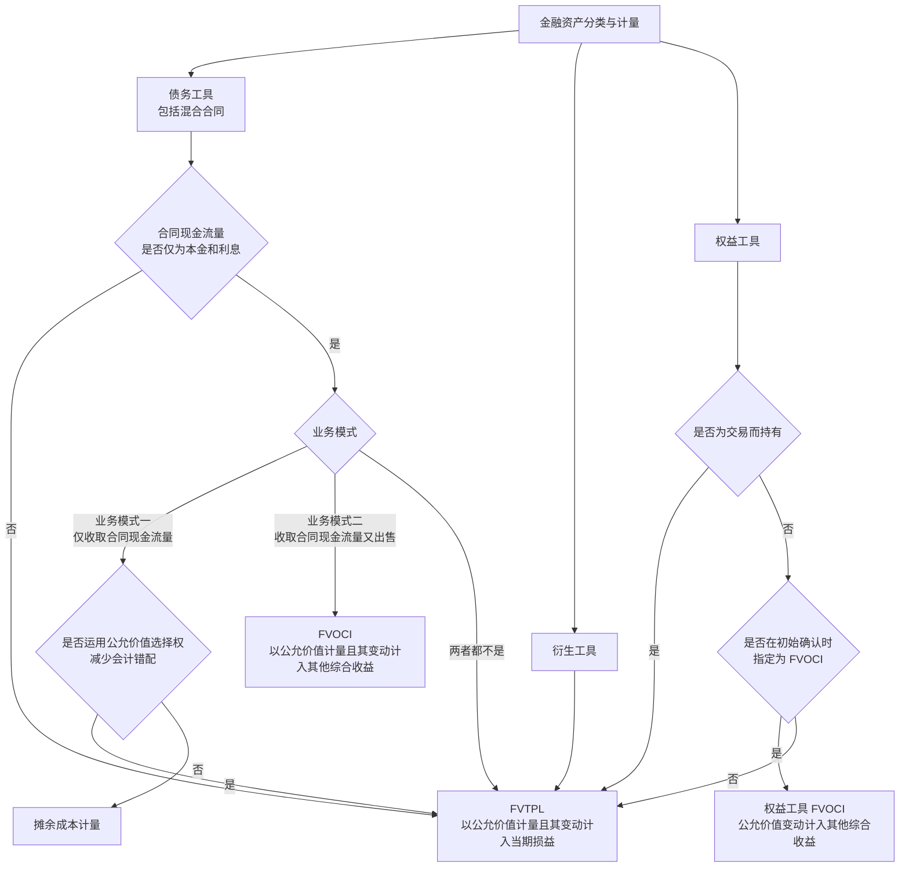
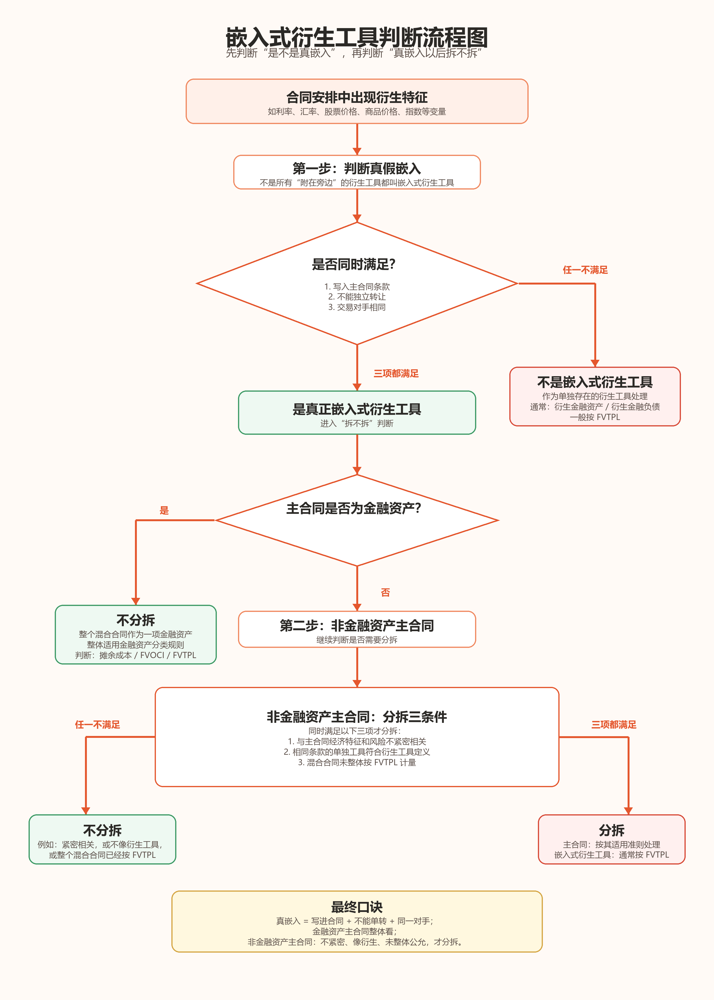
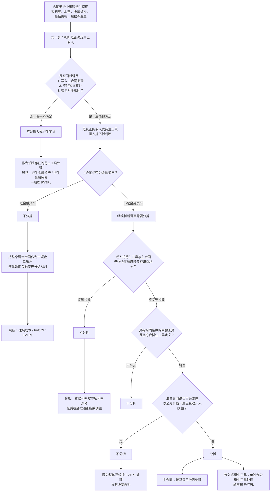
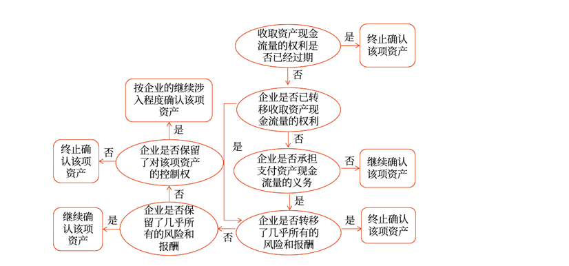

# 金融工具准则知识点

> 本文件用于整理金融工具准则的金融资产与金融负债分类、初始计量和后续计量、减值、重分类、终止确认、套期会计、权益工具投资和考试分录。

## 待整理规则

后续关于金融工具准则的问答，只有在明确要求“整理到 MD 文件”时，再追加到本文件。

新增内容优先沿用本仓库现有笔记格式：

```text
## 一、专题标题

### 核心结论

### 判断逻辑

### 易错点


### 记忆口诀
```

如涉及会计分录、表格、公式、分类判断、减值计算、利息收入、汇兑差额、其他综合收益或终止确认规则，应单独保留，避免只写结论。

## 一、金融工具准则总览

### 核心结论

金融工具准则可以先抓四条主线：

```text
1. 先识别：是不是金融资产、金融负债或权益工具；
2. 再分类：金融资产和金融负债分别归到哪一类；
3. 再计量：初始计量、后续计量、减值和利息处理；
4. 最后看特殊事项：重分类、终止确认、套期会计和列报。
```

### 判断逻辑

学习金融工具时，不要一开始就背分录，先按顺序判断：

```text
第一步：合同是否形成一方的金融资产，同时形成另一方的金融负债或权益工具；
第二步：金融资产看业务模式和合同现金流量特征；
第三步：金融负债看是否以公允价值计量且其变动计入当期损益，或按摊余成本计量；
第四步：再处理利息、减值、公允价值变动、处置和终止确认。
```

### 后续待补充专题

```text
金融资产三分类；
SPPI 测试；
摊余成本和实际利率法；
以公允价值计量且其变动计入其他综合收益；
以公允价值计量且其变动计入当期损益；
金融负债分类和自身信用风险；
金融工具减值三阶段模型；
金融资产重分类；
金融资产终止确认；
权益工具与金融负债的区分；
套期会计。
```


### 记忆口诀

```text
先识别，再分类；
先看资产负债属性，再看计量路径；
资产看模式和现金流，负债看义务和计量类。
```


## 二、金融资产分类与计量：总决策树

### 核心结论

这张图适合放在金融工具总览之后，作为金融资产分类与计量的总地图。

先按工具类型分三条线：

```text
债务工具：先做 SPPI，再看业务模式；
衍生工具：通常走 FVTPL；
权益工具：先排除交易性，再看是否指定 FVOCI。
```

### Mermaid 决策树



### 文字版判断顺序

第一，债务工具先看合同现金流量是否通过 SPPI。

```text
不通过 SPPI：直接 FVTPL；
通过 SPPI：再看业务模式。
```

第二，通过 SPPI 后，看业务模式。

```text
业务模式一：仅收取合同现金流量 -> 摊余成本；
业务模式二：既收取合同现金流量又出售 -> 债务工具 FVOCI；
两者都不是 -> FVTPL。
```

<span class="text-danger">红字重点：同一企业，可以有多种业务模式；同一组合，通常只能有一个业务模式。</span>

第三，即使本来可以走摊余成本，企业也可能因为会计错配而运用公允价值选择权，指定为 FVTPL。

第四，衍生工具通常直接走 FVTPL。

第五，权益工具先看是不是交易性。

```text
为交易而持有：FVTPL；
非交易性权益工具：可以选择是否指定 FVOCI；
不指定 FVOCI：通常 FVTPL。
```

### 易错点

第一，债务工具 FVOCI 和权益工具 FVOCI 来源不同。

```text
债务工具 FVOCI：通过 SPPI + 业务模式二得出；
权益工具 FVOCI：非交易性权益工具在初始确认时指定。
```

第二，衍生工具不是先做 SPPI，而是通常直接按 FVTPL。

第三，权益工具 FVOCI 是“可以指定”，不是必须指定；而且交易性权益工具不能指定。

第四，业务模式不是企业整体唯一战略，也不是管理层对单项资产的临时意图；它通常在金融资产组合层面判断。


### 记忆口诀

```text
债务先 SPPI，再看业务模式；
衍生多进损益；
权益先排交易，再看是否指定 OCI。

企业可多模，组合守一模。
```

## 三、金融资产定义：四类明细分类

### 核心结论

金融资产不只是“钱”，还包括未来能够收钱、收其他金融资产、收其他方权益工具，或者通过金融工具合同取得有利结果的权利。

可以先按四张卡片记：

```text
金融资产定义 - 明细分类一：现金、其他方权益工具、收取现金或其他金融资产的合同权利；
金融资产定义 - 明细分类二：潜在有利条件下交换金融资产或金融负债的合同权利；
金融资产定义 - 明细分类三：非衍生合同下，将收到可变数量自身权益工具；
金融资产定义 - 明细分类四：衍生合同下，用自身权益工具结算，但不满足固定换固定。
```

### 金融资产定义 - 明细分类一：现金、其他方权益工具、收款合同权利

这一类最基础。

```text
现金：本身就是金融资产；
其他方权益工具：比如持有其他公司的股票；
收取现金或其他金融资产的合同权利：比如应收账款、应收票据、债权投资。
```

要注意，预付账款通常不是金融资产。

```text
预付账款未来收到的是商品或服务；
不是收取现金或其他金融资产的合同权利；
所以不属于金融资产。
```

### 金融资产定义 - 明细分类二：潜在有利条件下交换金融工具的合同权利

这一类的核心是：企业持有一项合同权利，未来如果条件有利，可以通过交换金融资产或金融负债取得好处。

典型例子是买入期权。

```text
甲公司支付 5 万元期权费，取得一项看涨期权；
6 个月后，甲公司可以按 100 万元购买乙公司股票；
如果到期时乙公司股票市价高于 100 万元，甲公司可以行权；
如果市价低于 100 万元，甲公司可以不行权。
```

期权是否属于金融资产，不取决于预计是否行权，而取决于甲公司是否拥有这项合同权利。

```text
买期权：权利在手，潜在有利，通常是金融资产；
卖期权：义务在身，潜在不利，通常是金融负债。
```

初始取得期权时：

```text
借：衍生金融资产 / 交易性金融资产 5
    贷：银行存款 5
```

期末该期权公允价值上升至 8 万元：

```text
借：衍生金融资产 / 交易性金融资产 3
    贷：公允价值变动损益 3
```

到期行权，支付 100 万元取得乙公司股票，假设期权账面价值为 8 万元：

```text
借：交易性金融资产 / 其他权益工具投资 108
    贷：银行存款 100
        衍生金融资产 / 交易性金融资产 8
```

如果到期期权未行权并失效，假设期权账面价值为 8 万元：

```text
借：公允价值变动损益 8
    贷：衍生金融资产 / 交易性金融资产 8
```

### 金融资产定义 - 明细分类三：非衍生合同下收到可变数量自身权益工具

这一类非常容易绕，核心只抓一句：

```text
第三点只讨论企业未来收到自身权益工具，而且收到数量是可变的。
```

例子：

```text
甲公司支付 100 万元；
合同约定 6 个月后，甲公司将收到价值 100 万元的甲公司自身普通股；
收到股数按结算日甲公司股票价格确定。
```

如果结算日股价为 10 元，甲公司收到 10 万股；如果股价为 20 元，甲公司收到 5 万股。收到股数会变，本质上不是普通权益交易，而是一项金融资产。

取得合同权利并支付款项时：

```text
借：交易性金融资产 100
    贷：银行存款 100
```

期末该合同公允价值上升至 108 万元：

```text
借：交易性金融资产 8
    贷：公允价值变动损益 8
```

结算日收到自身普通股，假设合同金融资产账面价值为 108 万元：

```text
借：库存股 108
    贷：交易性金融资产 108
```

注意，真正收到自身股票后，企业持有的是库存股，不再作为金融资产列示。

反向情况也要区分：

```text
未来收可变数量自身权益工具：金融资产；
未来交可变数量自身权益工具：通常是金融负债。
```

### 金融资产定义 - 明细分类四：自身权益工具结算的衍生合同，但不满足固定换固定

第四点和第三点最大的区别是：

```text
第三点：非衍生合同，只讲收到可变数量自身权益工具；
第四点：衍生工具合同，既可能收到自身权益工具，也可能交付自身权益工具。
```

第四点的核心判断是“固定换固定”：

```text
固定金额现金或其他金融资产，换固定数量自身权益工具：通常作为权益工具；
只要不是固定换固定：通常作为金融资产或金融负债。
```

如果不满足固定换固定，还要看这项衍生工具在计量日对企业是有利还是不利：

```text
正公允价值：金融资产；
负公允价值：金融负债。
```

例子：

```text
甲公司签订一项以自身股票结算的衍生合同；
该合同不满足固定金额换固定数量自身股票；
期末该合同对甲公司的公允价值为正 20 万元。
```

期末确认金融资产：

```text
借：衍生金融资产 20
    贷：公允价值变动损益 20
```

以后该合同公允价值变为负 15 万元，说明从有利头寸转为不利头寸：

```text
借：公允价值变动损益 35
    贷：衍生金融资产 20
        衍生金融负债 15
```

如果合同最终以交付自身股票结算，结算时再冲销相关衍生金融资产或衍生金融负债，并按实际结算安排处理所有者权益。考试阶段先抓住判断口径：

```text
固定换固定：权益工具；
不是固定换固定：衍生金融工具；
正值是资产，负值是负债。
```

### 衍生金融工具的科目表达

衍生金融工具在分录中既可能看到专门科目，也可能看到交易性金融资产或交易性金融负债。

更标准的表达可以写：

```text
衍生金融资产；
衍生金融负债；
衍生工具。
```

但从金融工具分类结果看，大多数衍生工具通常属于：

```text
以公允价值计量且其变动计入当期损益的金融资产或金融负债；
也就是常说的交易性金融资产或交易性金融负债。
```

所以考试写分录时，如果题目没有指定科目，可以优先写：

```text
借：衍生金融资产
    贷：公允价值变动损益

借：公允价值变动损益
    贷：衍生金融负债
```

理解上要知道：

```text
科目表达：衍生金融资产 / 衍生金融负债；
分类属性：通常属于交易性金融资产 / 交易性金融负债；
损益逻辑：公允价值变动通常计入当期损益。
```

### 易错点

第一，期权是否属于金融资产，不看预计会不会行权，而看企业是否持有合同权利。预计不会行权只会影响期权公允价值，不改变金融资产身份。

第二，第三点只限于企业未来收到可变数量自身权益工具。这个点不能扩大成所有自身权益工具结算。

第三，第四点是衍生工具合同，既可能收也可能交；不满足固定换固定时，正公允价值确认为金融资产，负公允价值确认为金融负债。


### 记忆口诀

```text
一看现金和收款权；
二看期权等有利交换权；
三看非衍生，收可变自身股；
四看衍生，固定换固定。

第三点：只看收可变股；
第四点：正值资产，负值负债。
```

## 四、金融负债定义：应付职工薪酬不是金融负债

### 核心结论

应付职工薪酬虽然将来通常要支付现金，但在金融工具准则口径下，一般不作为金融负债。

关键原因是：

```text
金融负债不是“凡是以后要付钱的负债”；
金融负债强调来源于金融工具合同，并属于金融工具准则规范范围。
```

应付职工薪酬的来源是职工提供劳动服务，适用职工薪酬准则，而不是金融工具准则。

### 判断逻辑

金融工具合同的基本特征是：

```text
一方形成金融资产；
另一方形成金融负债或权益工具。
```

例如借款合同中，银行交付现金，企业承担还本付息义务。银行形成金融资产，企业形成金融负债。

但职工薪酬关系中，企业确认的是因职工服务形成的薪酬义务：

```text
职工提供劳动服务；
企业形成支付工资、奖金、福利等义务。
```

这类义务虽然可能以现金结算，但业务性质是职工薪酬负债，不是金融工具准则下的金融负债。

### 例子理解

例如，甲公司按年度奖金计划计提应付职工薪酬 30 万元：

```text
借：管理费用 / 生产成本等 30
    贷：应付职工薪酬 30
```

这笔负债以后可能通过现金支付，但仍属于职工薪酬准则规范的负债。

再对比金融负债：甲公司向证券公司借入丙上市公司股票并对外出售，未来需要归还该上市公司股票。丙上市公司股票对持有方属于金融资产，因此甲公司承担的是交付其他方权益工具的义务，通常属于金融负债。

### 题型辨析

判断“是否属于金融负债”时，不要只看是否未来付现金，而要看这项义务的来源和准则归属。

```text
产品质量保证金：通常是预计负债，不是金融负债；
应付职工薪酬：职工薪酬负债，不是金融负债；
预收货款：未来交商品或服务，不是金融负债；
借入其他方股票后需要归还：通常是金融负债。
```

### 易错点

第一，金融负债不是“所有现金支付义务”的总称。

第二，应付职工薪酬是负债，但通常不属于金融工具准则下的金融负债。

第三，金融负债判断要抓准则归属：如果已经由职工薪酬、收入、或有事项等准则规范，通常不要机械套入金融工具准则。


### 记忆口诀

```text
以后付钱，不一定是金融负债；
金融负债看金融工具合同；
职工给服务，企业欠薪酬；
走职工薪酬准则，不走金融负债。
```

## 五、权益工具与金融负债区分：两道门

### 核心结论

发行方判断一项工具是权益工具还是金融负债，可以先记成两道门：

```text
第一道：现金门
能不能无条件避免交付现金或其他金融资产？

第二道：自身权益工具门
如果用自己的股票结算，是不是固定换固定？
```

一般可以这样记：

```text
两道都通过，才是权益工具；
有一道没通过，通常就是金融负债。
```

### 第一道：现金门

第一道看发行方是否存在不可避免的现金或其他金融资产交付义务。

如果合同要求企业强制付息、强制赎回，或者其他情况下企业不能无条件避免交付现金或其他金融资产，通常属于金融负债。

如果分红或股息完全由企业有权机构决定，企业可以无条件避免支付现金，则现金门通过。

注意：

```text
经济压力 ≠ 合同义务。
```

例如，不发优先股股息会导致普通股不能分红，或者可能影响普通股价格，这些通常只是经济后果，不等于企业有合同义务必须支付现金。

### 第二道：自身权益工具门

如果合同将来以企业自身权益工具结算，还要继续判断是否满足固定换固定。

固定换固定的意思是：

```text
固定金额的现金或金融资产
换取固定数量的企业自身权益工具。
```

如果未来交付的自身股票数量固定，通常更接近权益工具。

如果未来交付的自身股票数量会随股价、业绩、指数或其他变量变化，企业承担的是交付可变数量自身权益工具的义务，通常不能作为权益工具，可能构成金融负债。

### 例子理解：签出期权满足固定换固定

签出期权或认股权证满足固定换固定的典型场景是：

```text
企业未来收取固定金额现金，
交付固定数量自身股票。
```

例如，甲公司签出一项认股权证：

```text
投资者现在支付权证价款 10 万元；
1 年后，投资者有权按每股 20 元购买甲公司普通股 10 万股；
甲公司只能交付股票，不能现金净额结算；
行权价格固定为每股 20 元；
交付股票数量固定为 10 万股。
```

到期如果投资者行权：

```text
甲公司收现金 = 20 × 10 万股 = 200 万元；
甲公司交付自身股票 = 10 万股。
```

这就是固定金额现金换固定数量自身股票，满足固定换固定，发行方通常可以把该认股权证作为权益工具。

发行认股权证收到价款时：

```text
借：银行存款 10
    贷：其他权益工具 / 资本公积 10
```

投资者行权时，假设股票面值 1 元：

```text
借：银行存款 200
借：其他权益工具 / 资本公积 10
    贷：股本 10
        资本公积--股本溢价 200
```

如果合同改成按行权日股价折算交付股数，或者企业可以选择现金净额结算，就不再是纯粹的固定换固定。

### 例子理解：优先股强制转股

甲公司发行优先股，无期限、无赎回机制，股息是否发放由董事会和股东会批准，但 10 年后强制转换为普通股。

第一步看现金门：

```text
股息不是强制支付；
不发股息只是限制普通股分红；
发行方可以避免现金支付。
```

所以现金门通常通过。

第二步看自身权益工具门：

```text
如果每 1 股优先股固定转换为 10 股普通股：
固定换固定，更接近权益工具。

如果按优先股面值 / 转换日普通股市价折算股数：
未来交付股数不固定，通常更接近金融负债。
```

所以这类题最关键的信息是：

```text
优先股转换为普通股的价格、数量条款。
```

### 结算选择权：多种结算方式怎么判断

如果一项衍生工具存在结算选择权，例如合同规定发行方或持有方可以选择以现金净额结算，或者以发行方股份交换现金等方式结算，判断权益工具还是金融负债 / 金融资产时，要看所有可供选择的结算方式。

核心规则是：

```text
所有可选择的结算方式都表明该衍生工具应确认为权益工具，才确认为权益工具；
只要有一种结算方式会导致金融负债或金融资产，就不能作为权益工具。
```

例子一：不能作为权益工具。

```text
甲公司签出认股权证，合同允许甲公司到期选择：
1. 收取固定行权价，交付固定数量自身股票；
2. 以现金净额结算。
```

虽然第 1 种方式可能满足固定换固定，但第 2 种方式涉及现金净额结算。只要存在这条现金结算路径，甲公司就不能说自己一定能避免金融负债或金融资产属性，因此通常不能分类为权益工具。

例子二：可以作为权益工具。

```text
甲公司签出认股权证，合同允许甲公司到期选择：
1. 交付固定数量 A 类自身普通股；
2. 交付固定数量 B 类自身普通股。
```

如果两种方式本质上都只是固定数量自身权益工具结算，不涉及现金，也不涉及可变数量自身股票，则所有结算路径都符合权益工具条件，可以作为权益工具。

这类题可以这样记：

```text
结算选择权看所有出口；
所有出口都通向权益，才是权益；
有一个出口通向现金或不固定，就不是权益。
```

### 易错点

第一，不要只看名称。叫“优先股”不一定就是权益工具。

第二，不要只看是否支付现金。即使没有强制付息，也要继续看自身权益工具结算是否固定换固定。

第三，不要把经济压力当成合同义务。会影响股价、影响普通股分红，不等于企业不能无条件避免支付现金。

第四，若是衍生工具且对企业有利，也可能形成金融资产；但在发行方判断自身发行工具属于权益还是金融负债的题目中，通常按“两道门”判断。


### 记忆口诀

```text
现金能避，股数固定；
两关都过，才进权益。

现金门不过，是负债；
自身股门不过，通常也是负债。
```

## 六、权益工具与金融负债区分：永续债等类似金融工具

### 核心结论

永续债等类似金融工具，发行方分类时不能只看名称叫不叫“永续债”，而要看发行方是否存在交付现金或其他金融资产的合同义务。

```text
没有交现金义务 -> 更接近权益工具；
有交现金义务 -> 更接近金融负债。
```

判断时重点看四个因素：

```text
到期日；
清偿顺序；
利率跳升；
间接义务。
```

### 一、到期日：看发行方能不能一直不还

如果合同明确规定：

```text
没有固定到期日；
持有人在任何情况下都无权要求发行方赎回或清算。
```

通常说明发行方没有交付现金或其他金融资产的合同义务，更接近权益工具。

如果合同没有固定到期日，但设置了未来赎回时间，且赎回是否发生不受发行方控制，或者发行方不能自主决定不赎回，就可能形成金融负债。

可以这样记：

```text
真能不还，像权益；
不能自主不还，像负债。
```

### 二、清偿顺序：看清算时排在哪里

如果永续债在清算时劣后于普通债务和其他债务，越接近股东剩余权益，越像权益工具。

```text
普通债务先还；
永续债后还；
股东最后分。
```

这种清偿顺序通常支持权益工具分类。

如果永续债与普通债务处于相同清偿顺序，就要谨慎判断，因为这可能表明它更像债务工具。

```text
清偿越靠后，越像权益；
和普通债同顺序，可能像负债。
```

### 三、利率跳升和间接义务：看是不是变相逼着赎回

有些永续债表面上写着发行方可以选择不赎回，但如果不赎回，票面利率会上升。这时要判断利率跳升是否构成间接义务。

如果跳升幅度较小、有最高票息限制，并且封顶利率未超过同期同行业同类型工具平均利率水平，可能不构成间接义务。

```text
小跳升 + 有封顶 + 不超过市场平均水平
-> 可能不构成间接义务
```

如果封顶票息水平超过同期同行业同类型工具平均利率水平，或者跳升幅度很大，导致发行方经济上几乎不得不赎回，通常构成间接义务。

```text
大跳升 / 高封顶 / 经济上几乎不得不赎回
-> 可能构成间接义务
-> 更接近金融负债
```

间接义务可以理解为：

```text
法律上看起来可以不付；
经济上几乎没法不付。
```

### 四、持有方分类：不跟着发行方机械走

发行方把永续债分类为权益工具，不代表持有方一定按权益工具投资处理。持有方要根据自己持有的金融资产分类规则判断。

如果该永续债在持有方角度属于权益工具投资：

```text
通常分类为 FVTPL；
符合条件且非交易性，可以初始指定为 FVOCI。
```

如果不属于权益工具投资，例如现金流更像债务工具，或者包含需要谨慎考虑的选择权，则持有方按金融资产分类规则判断：

```text
摊余成本；
FVOCI；
FVTPL。
```

### 易错点

第一，不要看到“永续”就直接认定为权益工具。永续债也可能因为赎回、付息、利率跳升等安排形成金融负债。

第二，不要只看合同表面上有没有“发行方可选择赎回”。如果不赎回会导致重大经济后果，可能形成间接义务。

第三，发行方分类和持有方分类不是镜像关系。发行方列权益，不代表持有方一定可以作为权益工具投资处理。

### 记忆口诀

```text
永续债，不看名；
看能不能真不还。

无到期、能递延、清偿靠后，像权益；
被迫赎、强付息、大跳升，像负债。
```

## 七、权益工具与金融负债区分：附回购条款增资的两种计量

### 核心结论

企业增发自身股份，同时约定在特定条件下回购股份时，要先判断是否存在不能无条件避免的现金支付义务，再判断该金融负债采用哪种后续计量。

~~~text
第一层：是否确认金融负债？
看企业能否无条件避免现金回购。

第二层：金融负债怎么计量？
普通金融负债默认采用摊余成本；
具有衍生性质或按真题口径归入 FVTPL 的负债采用公允价值计量。
~~~

不要根据“长期应付款”或“交易性金融负债”的科目名称倒推计量方法。正确顺序是：

~~~text
先确定金融负债类别和计量基础，
再选择对应会计科目。
~~~

### 金融负债后续计量的总规则

金融负债初始确认时原则上都按公允价值计量。后续计量时，除准则规定的特殊项目外，普通金融负债默认按摊余成本计量。

~~~text
普通金融负债：
摊余成本 + 实际利率法。

FVTPL 金融负债：
公允价值计量，变动通常计入当期损益。
~~~

FVTPL 金融负债主要包括：

~~~text
1. 交易性金融负债，包括属于金融负债的衍生工具；
2. 初始指定为以公允价值计量且其变动计入当期损益的金融负债；
3. 非同一控制下企业合并形成的或有对价金融负债等准则规定项目。
~~~

### 情况一：固定本金加固定利息，通常采用摊余成本

如果回购价格只是投资本金加固定利率收益，负债金额的增长主要来自时间经过和利息累积，更接近普通融资负债。

~~~text
回购价 = 固定本金 + 固定利息
→ 普通金融负债
→ 初始按回购金额现值确认
→ 后续按实际利率法采用摊余成本计量
→ 通常使用长期应付款等科目
~~~

#### 例题一：未上市则按本金加 8% 回购

2×25 年 1 月 1 日，甲公司按照每股 10 元向财务投资者增发 4 000 万股普通股，每股面值 1 元，共收到增资款 40 000 万元。协议约定：如果甲公司在 3 年内不能完成首次公开发行并上市，甲公司应按照投资本金加年利率 8% 的收益回购全部股份。

判断如下：

~~~text
甲公司不能无条件避免现金回购；
回购金额仅为本金加固定收益；
因此确认普通金融负债，采用摊余成本计量。
~~~

选择题应选：

~~~text
C. 增加长期应付款 40 000 万元。
~~~

选 C 不代表股本科目完全没有发生变动。股份已经依法增发并办理登记，法律形式上仍应反映股本和股本溢价：

~~~text
借：银行存款                              40 000
    贷：股本                               4 000
        资本公积——股本溢价                 36 000
~~~

同时，要把回购义务对应金额从权益中扣除并确认为金融负债。权益扣减的具体科目应结合题目给出的核算口径确定。

一种常见的“作收购库存股处理”的表达是：

~~~text
借：库存股                                40 000
    贷：长期应付款——股份回购义务             40 000
~~~

也有教材或真题答案直接冲减资本公积等权益项目：

~~~text
借：资本公积等权益项目
    贷：长期应付款 / 其他应付款——股份回购义务
~~~

两种表达的共同实质是：

~~~text
确认全额回购负债；
同时扣减所有者权益；
不能只把股本溢价 36 000 万元确认为负债。
~~~

后续按实际利率法确认融资费用。简化假设每年按照 8% 计算：

~~~text
40 000 × 8% = 3 200 万元

借：财务费用                               3 200
    贷：长期应付款——股份回购义务              3 200
~~~

### 情况二：回购金额与股权公允价值挂钩，真题按公允价值计量

如果回购价格不仅包含本金和固定收益，还直接与股权公允价值等市场变量挂钩，负债金额可能因为股权价格变化而大幅改变，不能只按照固定实际利率推算。

~~~text
回购价 = 股权公允价值与固定本息和孰高
→ 含有与股权价格挂钩的衍生性条款
→ 真题口径作为交易性金融负债
→ 按公允价值计量
→ 公允价值变动计入当期损益
~~~

该处理对应的是交易性金融负债中“属于金融负债的衍生工具”这一类，不是企业为了消除会计错配而主动指定为 FVTPL。

#### 例题二：2022 年计算分析题

2×19 年 1 月 1 日，乙公司向甲公司增资 5 000 万元，取得甲公司 20% 股权，其中 500 万元计入实收资本。协议约定：如果甲公司未来 3 年内不能实现 A 股上市，甲公司或者甲公司的控股股东需要回购乙公司持有的甲公司 20% 股权。

回购价格为下列两项孰高：

~~~text
1. 回购日甲公司 20% 股权的公允价值；
2. 5 000 万元本金加年利率 8% 的单利收益。
~~~

初始收到增资款：

~~~text
借：银行存款                               5 000
    贷：实收资本                              500
        资本公积                            4 500
~~~

真题答案将回购义务直接从权益重分类为交易性金融负债：

~~~text
借：资本公积                               5 000
    贷：交易性金融负债                       5 000
~~~

这说明直接借记资本公积并不是错误或天然不规范。准则的核心要求是“确认金融负债并相应扣减权益”，权益借方具体使用资本公积还是库存股，要结合题目背景和教材口径判断。

### 2×19 年末的计量

2×19 年 12 月 31 日，甲公司 100% 股权公允价值为 26 000 万元：

~~~text
20% 股权公允价值
= 26 000 × 20%
= 5 200 万元

固定本息和
= 5 000 ×（1 + 8%）
= 5 400 万元

两者孰高：5 400 万元。
~~~

交易性金融负债由 5 000 万元增加至 5 400 万元：

~~~text
借：公允价值变动损益                          400
    贷：交易性金融负债                          400
~~~

### 2×20 年末的计量

2×20 年 12 月 31 日，甲公司 100% 股权公允价值为 30 000 万元：

~~~text
20% 股权公允价值
= 30 000 × 20%
= 6 000 万元

固定本息和
= 5 000 ×（1 + 8%）+ 5 000 × 8%
= 5 800 万元

两者孰高：6 000 万元。
~~~

交易性金融负债由 5 400 万元增加至 6 000 万元：

~~~text
借：公允价值变动损益                          600
    贷：交易性金融负债                          600
~~~

这里增加的 600 万元不只是固定利息。固定本息和只增加了 400 万元，但由于股权公允价值上涨，最终负债增加了 600 万元。这正是该负债不能只按摊余成本计量的直观原因。

### 2×21 年解除回购条款

2×21 年 1 月 15 日，各方签订补充协议解除回购条款。该补充协议是资产负债表日后新签订的协议，不是对 2×20 年末已经存在事实的进一步证据，因此不属于 2×20 年资产负债表日后调整事项。

在 2×21 年解除回购义务时：

~~~text
借：交易性金融负债                         6 000
    贷：资本公积                           6 000
~~~

### 两道例题的核心对比

| 比较项目 | 固定本金加固定利息 | 股权公允价值与本息和孰高 |
| --- | --- | --- |
| 回购金额 | 按时间累积，较为确定 | 随股权公允价值变化 |
| 负债性质 | 普通金融负债 | 含股权价格挂钩的衍生性质 |
| 常用科目 | 长期应付款 | 交易性金融负债 |
| 后续计量 | 摊余成本 | 公允价值 |
| 变动损益 | 财务费用 | 公允价值变动损益 |

### 易错点

第一，不能说所有附回购条款的增资都采用长期应付款，也不能说所有回购义务都采用交易性金融负债。必须看回购价格的形成方式。

第二，不要把“是否确认金融负债”和“金融负债如何后续计量”混为一个问题。

~~~text
先判断能否无条件避免交付现金；
再判断是摊余成本还是公允价值计量。
~~~

第三，不能把“借记库存股”或“借记资本公积”中的任何一种说成所有场景下唯一正确的做法。考试应当优先遵循题目背景和教材答案；两者共同效果都是扣减权益并确认回购负债。

第四，股份依法增发意味着股本客观上发生变动，但确认等额权益扣减和金融负债后，所有者权益净增加额可能为零。


### 记忆口诀

~~~text
先看能否避现，再看负债计量；
固定本息走摊余，长期应付款；
挂钩股价走公允，交易性负债；
库存股或资本公积，都是权益扣减口径。
~~~

## 八、权益工具与金融负债区分：子公司少数股东看跌期权

### 核心结论

母公司向子公司少数股东签出看跌期权时，要区分三张报表视角：

```text
母公司个别报表：看成签出以子公司股份为标的的期权，通常确认衍生金融负债；
子公司报表：不是子公司签约，通常不处理；
母公司合并报表：看成集团承担现金回购少数股东权益的义务，确认金融负债。
```

这类题最核心的一句话是：

```text
不是等少数股东一定行权才确认负债；
而是看集团是否已经不能无条件避免交付现金。
```

### 为什么个别报表是衍生金融负债

在母公司个别报表中，母公司签出的是一项看跌期权：

```text
标的：子公司股份；
价值：随子公司股份价格变动；
结算：未来如果少数股东行权，母公司支付现金买入子公司股份。
```

所以个别报表中，这项看跌期权符合衍生工具特征，通常按衍生金融负债或交易性金融负债处理，公允价值变动计入当期损益。

### 为什么合并报表是金融负债

在合并报表中，子公司已经纳入集团，子公司少数股东权益属于合并报表所有者权益的一部分。

```text
合并报表所有者权益
= 归属于母公司所有者权益
+ 少数股东权益
```

但看跌期权使少数股东有权要求集团用现金买回这部分权益。主动权在少数股东手里，集团不能无条件避免支付现金。

因此，合并报表中应确认金融负债，金额通常按未来回购所需支付金额的现值计量。

注意：合并层面重点不是期权公允价值，而是回购少数股东权益的现金支付义务。

### 例题和分录

甲公司持有乙公司 80% 股权，乙公司为甲公司的子公司。2×25 年 1 月 1 日，甲公司向乙公司少数股东签出一项看跌期权：如果 6 个月后乙公司股价下跌，少数股东有权要求甲公司以固定价格 1,000 万元购买其持有的乙公司 20% 股权。

假设签约日：

```text
看跌期权公允价值 = 60 万元；
6 个月后应支付金额 1,000 万元的现值 = 950 万元。
```

#### 1. 甲公司个别报表

签出期权时，按期权公允价值确认衍生金融负债：

```text
借：公允价值变动损益 60
    贷：衍生金融负债 / 交易性金融负债 60
```

如果期权初始公允价值为 0，初始可不作分录；后续公允价值变动再确认损益。

6 个月后，若行权前该期权公允价值变为 100 万元，补确认公允价值变动：

```text
借：公允价值变动损益 40
    贷：衍生金融负债 / 交易性金融负债 40
```

行权时，甲公司支付 1,000 万元购买乙公司剩余 20% 股权，形成追加长期股权投资：

```text
借：长期股权投资 1,000
    贷：银行存款 1,000
```

同时终止确认相关衍生金融负债。考试如果不专门考个别报表期权结算细节，重点抓：个别报表确认衍生金融负债，并按公允价值变动计入损益。

#### 2. 乙公司报表

乙公司不是该看跌期权合同的签约方，没有取得权利，也没有承担义务。

```text
乙公司不作会计处理。
```

#### 3. 甲公司合并报表

合并报表中，集团承担了未来可能以现金回购少数股东权益的义务。签约日按回购金额现值确认金融负债：

```text
借：少数股东权益 / 资本公积等权益项目 950
    贷：金融负债 950
```

随着时间推移，现值由 950 万元增加到 1,000 万元，确认利息影响：

```text
借：财务费用 50
    贷：金融负债 50
```

实际行权支付时：

```text
借：金融负债 1,000
    贷：银行存款 1,000
```

行权后，甲公司取得剩余 20% 股权，属于购买子公司少数股权的权益性交易，合并报表中一般不确认新的商誉或损益，差额调整资本公积等权益项目。

### 三张报表对比

| 报表层面 | 看待对象 | 会计处理 | 金额基础 |
| --- | --- | --- | --- |
| 甲公司个别报表 | 签出的看跌期权 | 衍生金融负债 / 交易性金融负债 | 期权公允价值 |
| 乙公司报表 | 不是乙公司签约 | 不处理 | 无 |
| 甲公司合并报表 | 回购少数股东权益的现金义务 | 金融负债 | 回购金额现值 |

### 易错点

第一，少数股东权益本来是合并报表所有者权益的一部分；但如果少数股东有权要求集团现金回购，相关权益会触发金融负债判断。

第二，不是等未来确定行权才确认金融负债。只要合同使企业不能无条件避免交付现金，就要确认相关金融负债。

第三，个别报表和合并报表金额基础不同：个别报表看期权公允价值，合并报表看回购金额现值。


### 记忆口诀

```text
个别报表看期权，按公允价值；
子公司没签约，不处理；
合并报表看回购义务，按支付金额现值。

不是看会不会真的回购，
而是看企业还能不能单方面拒绝付钱。
```

## 九、复合金融工具：可转换公司债券的发行费用分摊

### 核心结论

发行可转换公司债券时，应先在不考虑发行费用的情况下，将收到的总对价拆分为负债成分和权益成分；再按照两者公允价值的相对比例分摊发行费用。

```text
先拆负债与权益；
再按公允价值比例分费用。
```

```text
分给负债成分的发行费用：减少负债成分的初始账面价值，通过增加“应付债券——利息调整”的借方金额体现。
分给权益成分的发行费用：直接冲减权益成分，借记“其他权益工具”。
```

### 分摊公式

设负债成分公允价值为 L、权益成分公允价值为 E、发行费用总额为 C：

```text
负债分摊的发行费用 = C × L ÷ (L + E)
权益分摊的发行费用 = C × E ÷ (L + E)
负债成分初始账面价值 = L - 负债分摊的发行费用
权益成分初始确认金额 = E - 权益分摊的发行费用
```

### 分录结构

先拆分负债成分和权益成分：

```text
借：银行存款
    应付债券——可转换公司债券（利息调整）
    贷：应付债券——可转换公司债券（面值）
        其他权益工具
```

支付发行费用并进行分摊：

```text
借：应付债券——可转换公司债券（利息调整）
    其他权益工具
    贷：银行存款
```

负债承担的发行费用增加“利息调整”的借方金额，从而减少负债初始账面价值；权益承担的发行费用直接冲减“其他权益工具”。

### 完整例题

甲公司按面值发行可转换公司债券，债券面值及发行收入为1 000万元，期限3年，票面利率4%并每年付息，类似普通债券的市场利率为8%，发行费用为20万元。

#### 第一步：拆分负债成分和权益成分

```text
负债成分公允价值
= 40 ×（P/A，8%，3）+ 1 000 ×（P/F，8%，3）
= 896.92 万元

权益成分公允价值
= 1 000 - 896.92
= 103.08 万元
```

暂不考虑发行费用时：

```text
借：银行存款                               1 000.00
    应付债券——可转换公司债券（利息调整）   103.08
    贷：应付债券——可转换公司债券（面值） 1 000.00
        其他权益工具                        103.08
```

#### 第二步：分摊发行费用

```text
负债分摊发行费用 = 20 × 896.92 ÷ 1 000 = 17.94 万元
权益分摊发行费用 = 20 × 103.08 ÷ 1 000 = 2.06 万元
```

分录：

```text
借：应付债券——可转换公司债券（利息调整） 17.94
    其他权益工具                            2.06
    贷：银行存款                           20.00
```

发行和发行费用也可以合并列示：

```text
借：银行存款                                 980.00
    应付债券——可转换公司债券（利息调整）     121.02
    贷：应付债券——可转换公司债券（面值）   1 000.00
        其他权益工具                          101.02
```

最终初始确认金额为：

```text
负债成分账面价值 = 1 000 - 121.02 = 878.98 万元
权益成分金额     = 103.08 - 2.06 = 101.02 万元
```

两者合计980万元，正好等于扣除发行费用后的净收款。

### 发行费用为什么会改变负债实际利率

8%用于计算发行费用分摊前负债成分的公允价值。负债承担17.94万元发行费用后：

```text
负债初始账面价值：由896.92万元降为878.98万元；
未来合同现金流：每年支付40万元利息，到期支付1 000万元本金，保持不变。
```

企业实际取得的负债净额变少，但未来付款没有减少，因此后续实际利率会提高。新的实际利率应满足：

```text
878.98
= 40 ÷ (1 + r)
+ 40 ÷ (1 + r)²
+ 1 040 ÷ (1 + r)³
```

计算得到发行费用分摊后的负债实际利率约为8.7607%。

第一年确认利息费用：

```text
878.98 × 8.7607% = 77.00 万元

借：财务费用                                77.00
    贷：应付利息                            40.00
        应付债券——可转换公司债券（利息调整）37.00
```

### 题目中的两个利率要区分

```text
类似普通债券的市场利率：用于计算负债成分公允价值，从而拆分负债与权益。
考虑发行费用后的实际利率：用于负债成分初始确认后的实际利率法摊销。
```

如果题目只给类似普通债券的市场利率，并要求考虑发行费用，应根据扣除负债所承担发行费用后的初始账面价值重新计算实际利率。

如果题目明确给出的是“考虑发行费用后的实际利率”，则直接使用，不再重新计算。

### 易错点

第一，发行费用不是全部计入财务费用，也不是全部冲减负债，必须在负债成分和权益成分之间按公允价值比例分摊。

第二，负债分摊的发行费用不会改变债券面值和票面现金流，只会降低负债初始账面价值，因此通常会提高实际利率。

第三，权益成分一经初始确认，后续通常不重新计量；分摊给权益的发行费用直接冲减“其他权益工具”。


### 记忆口诀

```text
先拆负债和权益，
再按公允比例分费用；
负债费用减账面，
权益费用直接冲权益；
净额变小、付款不变，
负债实际利率会上升。
```

### 例题：附持有人回售权的可转换债券

题目条件：甲公司发行可转换债券，票面利率 2%，持有人有权在第 2 年要求甲公司按本金和未支付利息的合计金额赎回；也有权在第 3 年末以每股 10 元的价格，按债券面值转换为甲公司普通股。

看到这种题，不要因为“持有人有回售权，企业不能无条件避免交付现金”，就直接把整个工具都看成金融负债。正确拆法是：

```text
不能无条件避免交付现金 -> 至少有金融负债成分；
固定换固定的转股权 -> 仍然可以单独作为权益成分。
```

#### 第一步：拆普通债券本金和利息

企业每年要支付利息，到期或回售时可能要偿还本金和未付利息。这一部分企业不能无条件避免交付现金，因此属于金融负债成分。

```text
债券本金和利息部分：金融负债成分
后续计量：通常按摊余成本，用实际利率法核算
```

这里要注意：票面利息不等于利息费用。

```text
票面利息 = 实际按票面利率支付的现金利息；
利息费用 = 负债成分账面价值 × 实际利率。
```

#### 第二步：看转股权是否符合权益工具

本题转股条件是：

```text
债券面值 ÷ 每股 10 元 = 可转换的普通股股数
```

也就是：

```text
固定金额的债券本金
换
固定数量的企业自身普通股
```

符合“固定换固定”，因此转股权作为权益工具成分处理。

```text
转股权：权益工具成分
常见科目：其他权益工具
```

#### 第三步：看持有人回售权是否单独拆分

本题持有人回售价格是：

```text
本金 + 尚未支付利息
```

这类回售权围绕债券本金和利息结算，和债务主合同的经济特征和风险紧密相关，通常不单独拆成衍生金融工具。

```text
回售权：与债务主合同紧密相关
处理：不单独拆分，包含在负债成分中考虑
```

所以本题的完整结构是：

```text
债券本金和利息：金融负债成分，摊余成本；
转股权：权益工具成分，其他权益工具；
持有人回售权：紧密相关，不单独拆分。
```

#### 选项判断

A 正确：转股权符合固定换固定，作为权益工具核算。

B 错误：每年按面值和票面利率计算的是应付利息，不是实际利率法下的利息费用。

C 错误：金融负债没有“指定为以公允价值计量且其变动计入其他综合收益”的常规分类。

D 错误：回售权按本金和未付利息赎回，通常与债务主合同紧密相关，不单独拆分为衍生金融工具。

```text
正确选项：A
```

#### 易错点

```text
不能避免付现金，只说明有负债成分；
固定换固定的转股权，仍然可以形成权益成分。
```

这道题的标签是：

```text
附持有人回售权的复合金融工具。
```

### 例题：可转债专门借款利息资本化

这类题的难点不是普通借款费用资本化，而是可转换公司债券本身是复合金融工具，募集资金要先拆成负债成分和权益成分。

```text
只有负债成分产生借款费用；
权益成分不是借款，不产生借款费用。
```

所以专门借款闲置资金取得投资收益时，也不能全部冲减资本化利息，而要先判断这部分投资收益中有多少属于负债成分资金。

#### 第一步：先拆可转债负债成分和权益成分

题目中发行可转换公司债券募集资金 20 000 万元，票面利率 4%，类似不附转换权债券的市场利率为 6%。

```text
负债成分初始入账金额
= 20 000 × 4% ×（P/A，6%，3）+ 20 000 ×（P/F，6%，3）
= 20 000 × 4% × 2.6730 + 20 000 × 0.8396
= 18 930.4 万元

权益成分初始入账金额
= 20 000 - 18 930.4
= 1 069.6 万元
```

这里的 18 930.4 万元才是“借款”部分，后续借款费用按这个负债成分的账面价值和实际利率计算。

#### 第二步：判断开始资本化日期

借款费用开始资本化，需要同时满足三个条件：

```text
资产支出已经发生；
借款费用已经发生；
为使资产达到预定可使用或者可销售状态所必要的购建或者生产活动已经开始。
```

本题中：

```text
2×20 年 1 月 1 日：发行债券，借款费用已经发生；
2×20 年 2 月 1 日：预付工程款，资产支出已经发生；
2×20 年 4 月 1 日：工程正式动工，必要购建活动开始。
```

所以开始资本化日是三者最晚的日期：

```text
2×20 年 4 月 1 日
```

#### 第三步：2020 年资本化金额公式

```text
2020 年资本化金额
= 负债成分利息费用 × 资本化月份 / 12
- 闲置资金投资收益 × 负债成分闲置资金 / 全部闲置资金
```

代入题目：

```text
= 18 930.4 × 6% × 9/12
- 270 × (18 930.4 - 2 000) / (20 000 - 2 000)
= 597.91 万元
```

公式拆开看：

```text
18 930.4 × 6% × 9/12
```

是 2020 年资本化期间内负债成分产生的利息费用。资本化从 4 月 1 日开始，所以是 9 个月。

```text
270 × (18 930.4 - 2 000) / (20 000 - 2 000)
```

是闲置资金投资收益中，属于负债成分资金的部分。

2 月 1 日已经预付工程款 2 000 万元，所以：

```text
全部闲置资金 = 20 000 - 2 000
负债成分闲置资金 = 18 930.4 - 2 000
```

也可以换一种更好记的写法：

```text
属于负债成分的闲置资金比例
= 1 - 权益成分金额 / 全部闲置资金
= 1 - 1 069.6 / 18 000
```

#### 第四步：2021 年资本化金额公式

2021 年先更新负债成分的账面价值：

```text
2021 年初负债账面价值
= 18 930.4 × (1 + 6%) - 20 000 × 4%
```

意思是：

```text
期初负债账面价值
+ 2020 年实际利息费用
- 2020 年支付的票面利息
```

所以 2021 年资本化金额为：

```text
= [18 930.4 × (1 + 6%) - 20 000 × 4%] × 6%
- 160 × (18 930.4 - 2 000 - 10 000) / (20 000 - 2 000 - 10 000)
= 1 017.37 万元
```

后半段仍然是在扣除闲置资金投资收益中属于负债成分的部分。

到 2021 年，已经支付工程款：

```text
2 000 + 10 000 = 12 000 万元
```

所以：

```text
全部闲置资金 = 20 000 - 2 000 - 10 000
负债成分闲置资金 = 18 930.4 - 2 000 - 10 000
```

同样也可以理解为：

```text
属于负债成分的闲置资金比例
= 1 - 权益成分金额 / 全部闲置资金
= 1 - 1 069.6 / 8 000
```

#### 第五步：转股后的影响

如果可转换债券在 2×22 年 1 月 1 日全部转换为普通股，则负债成分已经消失，之后不再产生该债券对应的借款费用。

```text
转股前：负债成分产生借款费用，符合条件的部分可以资本化；
转股后：负债成分转为权益，不再有该债券的利息费用资本化问题。
```

#### 会计处理思路

资本化利息计入在建工程：

```text
借：在建工程
    贷：应付债券——可转换公司债券（利息调整）/ 应付利息等
```

闲置资金投资收益中属于负债成分的部分，冲减资本化金额；属于权益成分的部分，不冲减借款费用资本化金额。

#### 易错点

```text
可转债募集资金不是全都是借款；
只有负债成分产生借款费用；
权益成分对应的闲置收益，不能冲减资本化利息。
```

这道题的比例可以记成两种等价写法：

```text
负债成分闲置资金 / 全部闲置资金

或者

1 - 权益成分金额 / 全部闲置资金
```

一句话记：

```text
利息按负债成分算；
收益按负债成分占闲置资金比例扣。
```

## 十、金融资产分类：SPPI 中的正常利息与杠杆效应

### 核心结论

SPPI（Solely Payments of Principal and Interest）判断的重点，不是看合同里有没有“利息”两个字，而是看这项利息是不是基本借贷安排下的正常利息。

正常利息通常可以补偿：

```text
货币时间价值；
信用风险；
流动性风险；
管理成本；
合理利润。
```

如果利息条款把某个风险或变量放大，或者和股票价格、商品价格、企业利润等非基本借贷风险挂钩，就可能不符合 SPPI。

通胀指数挂钩要单独理解：

```text
如果债券本金和利息与该金融资产计价货币的通胀指数挂钩，
通常可以理解为对货币时间价值的调整，
目的是补偿通胀对货币购买力的侵蚀，
一般不当然破坏 SPPI。
```

但如果挂钩的是非计价货币通胀指数，或者商品价格指数、权益指数等非基本借贷风险变量，就要谨慎判断，可能不符合 SPPI。

### 判断逻辑

第一，要用金融资产的计价货币来评估合同现金流量特征。

```text
人民币计价的金融资产，用人民币利率环境判断；
美元计价的金融资产，用美元利率环境判断。
```

不要拿错货币环境去判断现金流量是不是本金和正常利息。

第二，有完全追索权、有抵押物或有担保，通常不影响 SPPI 判断。

```text
追索权、抵押、担保：主要影响信用风险；
不改变合同现金流量本身是否为本金和正常利息。
```

所以，有担保贷款并不会因为有抵押物就不符合 SPPI。

第三，利率基准从“贷款基准利率”调整为“贷款市场报价利率”，本身不会导致不符合 SPPI。

这种调整只是把一个正常市场利率基准换成另一个正常市场利率基准，仍然可能是基本借贷安排。


### 卡片：利息构成要素看补偿性质

判断 SPPI 时，不能只看合同里写了“利息”，也不能只看利息金额大小，而要看这笔利息是在补偿什么。

正常利息补偿的是基本借贷安排中的风险和成本：

```text
货币时间价值；
信用风险；
流动性风险；
管理成本；
合理利润。
```

如果利息和非基本借贷风险或成本的变量挂钩，就不符合 SPPI。

常见不符合的情形包括：

```text
利息和权益工具价值挂钩；
利息和商品价格挂钩；
利息和碳价格指数等市场变量挂钩；
合同现金流量代表债务人收入或利润的一部分。
```

例如，贷款合同约定利率与碳价格指数挂钩。碳价格指数不是货币时间价值、信用风险、流动性风险、管理成本或合理利润的补偿，而是商品或市场价格变量，所以不符合 SPPI。

再比如，合同约定除偿还本金外，借款人还要把净利润的 5% 支付给贷款人。这时贷款人不是单纯取得正常借贷利息，而是参与了债务人的经营成果，也不符合 SPPI。

一句话记：

```text
利息补偿借贷风险和成本，可以；
利息挂钩商品价格、权益价值、收入利润，不行。
```


### 卡片：或有特征引起的现金流量变动

或有特征可以理解为：未来发生某件事时，合同现金流量会发生变化。

例如：

```text
信用评级下降，贷款利率上调；
达到 ESG 或碳减排目标，贷款利率下调；
销售额达到某个水平，贷款利率变化。
```

判断这类条款是否符合 SPPI，核心看两步。

第一步，看或有事项是否和基本借贷风险及成本直接相关。

如果或有事项与基本借贷风险和成本直接相关，而且现金流量变化方向一致，通常仍然符合基本借贷安排。

例如：

```text
借款人信用评级下降；
信用风险上升；
贷款利率上调。
```

这属于风险变高、补偿变高，方向一致，通常可以通过 SPPI。

第二步，如果或有事项和基本借贷风险及成本不直接相关，就要看现金流量差异是否显著。

如果在所有可能的合同情形下，含有该或有特征的现金流量，与不含该特征的普通借贷现金流量不存在显著差异，仍然可能通过 SPPI。

### 例子：碳减排目标小幅降息

例如，贷款合同约定：

```text
贷款利率为 3%；
如果债务人当年达到碳减排目标，贷款利率下调至 2.9%。
```

这里“是否达到碳减排目标”属于或有事项，不是“碳价格指数”变量。它没有直接把利息和商品价格或碳价格风险挂钩。

如果 3% 和 2.9% 的现金流量差异不显著，可以认为合同现金流量仍然只是本金和以未偿付本金金额为基础的利息支付，能够通过 SPPI。

但如果合同写成：

```text
贷款利率随碳价格指数变动；
或者贷款利率直接挂钩商品价格、权益工具价值。
```

这就不是简单的或有激励，而是引入了非基本借贷风险，通常不符合 SPPI。

一句话记：

```text
风险变，利率跟着合理变，通常可以；
非借贷事项小幅激励，看差异是否显著；
直接挂钩商品价格、权益价值，通常不行。
```

### 例子理解

利率为“贷款市场报价利率 + 100 基点”的贷款，通常符合 SPPI。

```text
LPR + 100 基点
= LPR + 1%
```

这个 1% 可以理解为信用风险、流动性风险、管理成本和合理利润等补偿，仍然是正常借贷利息。

但利率为“贷款市场报价利率向上浮动 10%”的贷款，不符合 SPPI。

```text
LPR 向上浮动 10%
= LPR × 1.10
```

这里不是简单加一个固定点差，而是把基准利率的变动按比例放大。基准利率越高，额外上浮金额也越大，存在杠杆效应。

例如：

```text
如果 LPR = 4%，LPR × 1.10 = 4.4%；
如果 LPR = 5%，LPR × 1.10 = 5.5%。
```

实际利率的变化被基准利率变化带着放大，不再只是基本借贷安排下的正常利息。

### 易错点

不要把“加点”和“上浮比例”混在一起。

```text
LPR + 固定点差：通常是正常利息补偿；
LPR × 固定倍数：可能产生杠杆效应。
```

也不要认为有抵押、有担保、有追索权就会破坏 SPPI。它们通常只是降低信用风险，不改变合同现金流量特征。


### 记忆口诀

```text
SPPI 看现金流，
只要本金和正常息；
加点通常没问题，
乘倍数要防杠杆。
```

## 十一、金融资产分类：应收款项融资与 FVOCI

### 核心结论

“应收款项融资”是报表列报项目，不是金融资产分类名称。

实务中，它通常对应的是以公允价值计量且其变动计入其他综合收益的债务工具金融资产，也就是 FVOCI。

可以这样理解：

```text
应收票据 / 应收账款
如果满足 FVOCI 债务工具分类条件，
报表上通常列示为“应收款项融资”。
```

### 判断逻辑

应收票据或应收账款不是随便“转到”应收款项融资，而是因为其金融资产分类和业务模式不同。

通常需要同时满足两点：

```text
1. 业务模式：既以收取合同现金流量为目标，又以出售金融资产为目标；
2. 合同现金流量特征：符合 SPPI。
```

如果只是持有到期收款，通常是摊余成本计量，列示为应收账款或应收票据。

如果既可能收款，也可能背书、贴现、转让，并且现金流量符合 SPPI，则可能分类为 FVOCI，列示为应收款项融资。

### 例子理解

最常见的是银行承兑汇票。

```text
企业持有银行承兑汇票；
一方面可能持有到期向银行收款；
另一方面也可能背书转让或贴现。
```

这种业务模式通常不是单纯“持有收款”，而是：

```text
收取合同现金流量 + 出售金融资产。
```

如果该票据现金流量符合 SPPI，就可以分类为 FVOCI，并在报表中列示为应收款项融资。

### 易错点

第一，应收款项融资不是“应收账款换个名字”。它背后通常对应 FVOCI 债务工具分类。

第二，应收账款和应收票据都可能成为应收款项融资的来源，但实务中更常见的是银行承兑汇票。

第三，不是所有票据都一定列入应收款项融资。关键仍然看业务模式和 SPPI。

```text
普通应收账款：通常持有收款 -> 摊余成本 -> 应收账款；
银行承兑汇票等：收款 + 背书/贴现/转让 -> FVOCI -> 应收款项融资。
```


### 记忆口诀

```text
应收款项融资看分类，
不是简单改名字；
收款加出售，且通过 SPPI，
通常才进 FVOCI。
```

## 十二、权益工具 FVOCI：合伙企业份额通常不能直接指定

### 核心结论

FVOCI 是“以公允价值计量且其变动计入其他综合收益”，不是 FVTOCI。

非交易性权益工具投资可以在初始确认时指定为 FVOCI，但“合伙企业份额”通常不能简单当作普通权益工具投资。

考试中遇到有限合伙份额、普通合伙份额、基金份额、理财份额，通常要谨慎，不要直接指定为 FVOCI。

### 判断逻辑

金融工具准则里的权益工具，不是泛泛说“权益性投资”，而是指能够证明持有人拥有发行方扣除所有负债后剩余权益的合同。

普通公司股票最典型。

但合伙企业份额通常更复杂，可能存在：

```text
合伙期限有限；
到期清算或退伙时取得现金或净资产；
收益分配、退出、赎回安排由合伙协议约定；
持有人更像拥有一项按协议取得现金或其他金融资产的权利。
```

因此，不能因为它叫“合伙份额”，就直接认为它是可以指定为 FVOCI 的普通权益工具投资。

### 例子理解

甲公司以 600 万元认购某有限合伙企业 10% 的份额，合伙期限 5 年。

这类合伙企业份额不是上市公司普通股，也不当然满足权益工具定义。题目给出“合伙期限 5 年”“有限合伙人”等信息，通常是在提示它不是普通权益工具投资。

所以通常不能指定为 FVOCI，而应分类为：

```text
以公允价值计量且其变动计入当期损益的金融资产；
即 FVTPL。
```

### 易错点

第一，能否指定 FVOCI，不看是普通合伙人还是有限合伙人，而看该份额是否真正符合权益工具投资定义。

第二，发行方在特殊条件下列为权益，不代表投资方就能把该投资指定为 FVOCI。

第三，合伙企业份额、基金份额、理财份额，考试里通常不要直接当作普通权益工具投资。


### 记忆口诀

```text
普通股票，可看权益；
合伙基金，先别指定；
期限退出拿现金，
通常走 FVTPL。
```

## 十三、嵌入式衍生工具-概念和主合同

### 核心结论

嵌入式衍生工具可以先用一句话理解：

```text
一个普通合同里，藏了一个会让现金流量跟随某个变量变化的小衍生工具。
```

它不是单独签订的一份期权、远期或互换合同，而是嵌在一个主合同里。

以后本文件中与嵌入式衍生工具有关的内容，标题统一使用：

```text
嵌入式衍生工具-具体内容
```

### 判断逻辑

嵌入式衍生工具所在的合同，通常叫混合合同。

```text
混合合同 = 主合同 + 嵌入式衍生工具
```

主合同是外壳，可能是：

```text
租赁合同；
保险合同；
服务合同；
特许权合同；
债务工具合同；
含嵌入条款的贷款合同。
```

嵌入式衍生工具是藏在主合同里的特殊条款，它会让合同现金流量随着某个变量变化。

常见变量包括：

```text
利率；
汇率；
商品价格；
股票价格；
价格指数；
信用等级；
其他指数。
```

### 例子理解

例子一：租赁合同中租金按物价指数调整。

```text
主合同：3 年租赁合同；
嵌入式衍生工具：租金按一般物价指数调整的条款。
```

例子二：债券利息和股票指数挂钩。

```text
主合同：债券合同；
嵌入式衍生工具：利息随股票指数变化的条款。
```

例子三：贷款利息和黄金价格变化挂钩。

```text
主合同：贷款合同；
嵌入式衍生工具：利息随黄金价格变化的条款。
```

这些条款的共同点是：表面上是一个普通合同，但合同现金流量被某个外部变量带着变化。

### 和独立衍生工具的区别

嵌入式衍生工具必须真的嵌在主合同里，不能独立转让。

如果某项衍生工具虽然和金融工具有关，但它可以独立转让，或者交易对手方和主合同不同，就不是嵌入式衍生工具，而是独立存在的衍生工具。

例如：

```text
贷款合同旁边另签一份利率互换；
如果该利率互换可以单独转让，或交易对手方不同，
它就是独立衍生工具，不是嵌入式衍生工具。
```

### 易错点

第一，不是所有“变量条款”都一定要分拆。现在这一步只是理解概念，后面还要继续判断是否需要从主合同中分拆出来单独核算。

第二，嵌入式衍生工具不是单独存在的合同，而是混合合同中的一部分。能单独转让的衍生工具，通常不是嵌入式衍生工具。

第三，嵌入式衍生工具的难点不在“有没有变量”，而在后续判断：

```text
要不要分拆；
如果要分拆，怎么单独计量；
如果不能分拆，整个混合合同怎么分类。
```

### 嵌入式衍生工具-判断流程图

这张图先解决两个问题：

```text
第一层：它到底是不是真正嵌入式衍生工具；
第二层：如果是真正嵌入式衍生工具，要不要从主合同中分拆。
```





如果本地 Markdown 编辑器不渲染流程图，就按下面这条文字链判断：

```text
真嵌入 = 写进合同 + 不能单转 + 同一对手；
少一个条件，就不是嵌入式衍生工具，而是单独衍生工具。

真嵌入以后：
主合同是金融资产，整体分类，不分拆；
主合同不是金融资产，才看紧密相关；
不紧密、像衍生、整体未 FVTPL，才分拆。
```


### 嵌入式衍生工具-附回售权可转债的交叉提醒

附在债务工具中的回售权，如果赎回金额主要围绕本金和未付利息确定，通常与债务主合同的经济特征和风险紧密相关，不单独拆分。附持有人回售权的可转换债券例题，主线仍放在“复合金融工具”中理解。

### 记忆口诀

```text
普通合同是外壳，
变量条款藏其中；
跟随指数价格变，
就是嵌入式衍生。

能拆出去单独卖，
就不是嵌入式。
```

## 十四、金融资产和金融负债的确认与终止确认

### 核心结论

金融资产和金融负债的确认，先抓一句话：

```text
企业成为金融工具合同的一方时，确认金融资产或金融负债。
```

白话理解：

```text
合同已经让企业拥有收钱权利，或者承担付款义务，才确认。
```

但不同业务的“成为合同一方”和“形成无条件权利义务”的时间点不一样，所以要分场景判断。

### 一、普通应收应付：无条件权利或义务出现时确认

如果企业已经发货或提供服务，客户已经产生付款义务，企业已经拥有无条件收款权利，应确认金融资产。

```text
借：应收账款
    贷：主营业务收入
```

如果企业已经收到商品或服务，自己已经产生付款义务，应确认金融负债。

```text
借：存货 / 成本费用等
    贷：应付账款
```

只是签订采购订单或销售订单，通常还不确认金融资产或金融负债。因为此时还没有无条件收款权利或付款义务。

```text
签订单 ≠ 已经确认应收应付；
交货、收货、提供服务等履约事实出现后，才通常确认。
```

### 二、确定承诺买卖商品：通常等履约时确认

确定承诺是指企业已经承诺未来买卖商品或劳务，但双方还没有实际履约。

例如：1 月 1 日签订采购合同，约定 3 月 1 日采购原材料。1 月 1 日通常不确认应付账款，等收到货物或相关履约发生时再确认。

```text
普通买卖合同：通常等履约；
金融工具合同：成为合同一方时确认。
```

### 三、远期合同和期权合同：成为合同一方时确认

远期合同和期权合同本身属于金融工具，通常也是典型的衍生金融工具。企业成为合同一方时，应确认相关金融资产或金融负债。

远期合同通常符合衍生工具特征：

```text
价值随汇率、利率、商品价格、股票价格等变量变动；
初始净投资很小或为零；
在未来某一日期结算。
```

例如，甲公司签订远期外汇合同，约定 3 个月后按固定汇率买入美元。刚签约时，权利和义务公允价值通常相等，净额可能为零；后续公允价值变动时，才体现为衍生金融资产或衍生金融负债。

```text
刚签约时：公允价值通常为 0，可以不作分录或备查登记；
后续公允价值为正：确认衍生金融资产；
后续公允价值为负：确认衍生金融负债。
```

期权合同也是金融工具。买入期权时，通常确认衍生金融资产：

```text
借：衍生金融资产
    贷：银行存款
```

签出期权时，通常确认衍生金融负债：

```text
借：银行存款
    贷：衍生金融负债
```

如果期权或认股权证符合权益工具定义，则可能进入权益工具相关科目，仍要结合“现金门”和“固定换固定”判断。

### 四、金融负债的终止确认

金融负债终止确认，是指企业将之前确认的金融负债从资产负债表中转出。

核心条件是：

```text
金融负债的现时义务已经解除。
```

常见情形包括：

```text
已经偿还；
债权人豁免；
原金融负债被实质上不同的新金融负债替换；
原合同条款发生实质性修改。
```

如果企业与债权人签订协议，用新金融负债替换原金融负债，且新旧合同条款实质上不同，应终止确认原金融负债，同时确认新金融负债。

### 五、10% 测试：判断新旧负债是否实质不同

“实质上不同”或“实质性修改”通常看 10% 测试。

```text
新条款下未来现金流现值
与
原条款下剩余现金流现值
之间的差异达到或超过 10%
```

如果达到 10%，通常说明新旧金融负债实质上不同：

```text
终止确认原金融负债；
确认新金融负债。
```

如果没有达到 10%，通常不终止确认原金融负债，而是作为原金融负债条款修改处理。

一句话记：

```text
还掉、免掉、换成实质不同的新债，才终止确认；
新旧差异够不够大，常用 10% 测试。
```

### 六、电子支付系统结算的特殊规则

通常情况下，金融负债要等真正清偿才终止确认。但采用电子支付系统结算时，如果企业已经启动付款指令，并且同时满足以下条件，可以选择在结算日前终止确认金融负债：

```text
1. 企业没有实际能力撤回、停止或取消付款指令；
2. 企业没有实际能力支取因付款指令而将用于结算的现金；
3. 与电子支付系统相关的结算风险不重大。
```

白话理解：

```text
钱虽然还没到对方账户，
但企业已经按下付款键，
撤不回、拿不回、系统风险也很小，
就可以认为债务已经实质清偿。
```

例题时间线：

```text
1 月 3 日：采购形成应付账款；
1 月 10 日：启动不可撤销付款指令，并满足三个条件；
1 月 11 日：对方收到付款通知；
1 月 12 日：资金实际划转完成。
```

最早终止确认应付账款的时间是：

```text
1 月 10 日
```

因为这一天企业已经满足电子支付系统下提前终止确认金融负债的条件。

### 七、金融资产重分类：重分类日和未来适用法

金融资产重分类不是一般会计政策变更，也不是会计估计变更，而是金融工具准则下的特殊处理。触发条件是：

```text
企业管理金融资产的业务模式发生变更。
```

重分类应当自重分类日起采用未来适用法处理：

```text
重分类日 = 导致业务模式变更后的首个报告期间的第一天。
```

如果企业以自然年度作为报告期间，业务模式在 2x25 年发生变更，则重分类日通常是：

```text
2x26 年 1 月 1 日
```

注意：这不是因为它被当成会计估计变更，而是因为业务模式是在后来真实改变的，重分类日以前的分类、利息、减值和损益不回头重算。

```text
业务模式真变了，未来才换轨；
以前不是错账，所以不追溯。
```

### 八、摊余成本与 FVOCI 互转：实际利率和预期信用损失不回头

金融资产在摊余成本计量和债务工具 FVOCI 之间重分类时，两个口径不因重分类本身调整：

```text
原实际利率不调整；
原已确认的预期信用损失计量不调整。
```

#### 1. 摊余成本转 FVOCI

摊余成本计量的金融资产重分类为其他债权投资时：

```text
1. 重分类日按公允价值计量新的其他债权投资；
2. 原账面价值与公允价值的差额计入其他综合收益；
3. 原实际利率继续沿用；
4. 原已确认的预期信用损失不因重分类本身重算或冲回。
```

可以压缩为：

```text
摊余转 FVOCI：
资产调到公允价，差额进 OCI；
利率和减值不回头。
```

#### 2. FVOCI 转摊余成本

其他债权投资重分类为摊余成本计量的金融资产时，也不调整原实际利率和预期信用损失计量。但这个方向要把以前累计计入其他综合收益的金额转出：

```text
1. 以重分类日公允价值作为过渡基础；
2. 将以前累计计入其他综合收益的利得或损失转出；
3. 调整该金融资产在重分类日的公允价值；
4. 调整后账面价值等于重分类日的摊余成本；
5. 原实际利率和预期信用损失计量不因重分类本身调整。
```

可以压缩为：

```text
FVOCI 转摊余：
公允价值只是过桥；
累计 OCI 倒回资产；
最后回到摊余成本线。
```

【红字】摊余成本和债务工具 FVOCI 互转时，不要重算实际利率，也不要因为重分类本身重新计量或冲回原预期信用损失。

### 记忆口诀

```text
确认看入场：成为金融工具合同一方；
普通应收应付，看无条件权利义务；
远期、期权，一签就是金融工具；
终止看清偿，修改看 10%；
电子支付撤不回、钱拿不回、风险小，可提前终止。
重分类看业务模式，首个报告期第一天换轨；
摊余 FVOCI 互转，利率减值不回头。
```

## 十五、会计计量-债权投资

### 核心结论

债权投资通常对应“以摊余成本计量的金融资产”。学习时抓四件事：

```text
初始计量：面值进成本，差额进利息调整；
后续计量：实际利率法确认利息收入；
信用减值：确认信用减值损失和减值准备；
处置或到期：结清账面明细，差额进投资收益。
```

债权投资的利息收入规则，不只对债权投资有用，也适用于其他按实际利率法确认利息的债务工具金融资产，例如其他债权投资。区别在于：债权投资不确认公允价值变动，其他债权投资的公允价值变动计入其他综合收益。

### 一、初始计量

债权投资初始入账时，要把实际支付价款拆开看：

```text
债权投资——成本：债券面值；
应收利息：已到付息期但尚未领取的利息；
债权投资——利息调整：实际支付价款与面值、已到期未领取利息之间的差额。
```

典型分录：

```text
借：债权投资——成本
    应收利息
    债权投资——利息调整（差额，也可能在贷方）
    贷：银行存款
```

如果是折价购入，利息调整可能在贷方：

```text
借：债权投资——成本
    应收利息
    贷：银行存款
        债权投资——利息调整
```

记忆：

```text
成本放面值；
到期未收利息单独放应收利息；
剩下差额塞进利息调整。
```

### 二、后续计量：利息收入和利息调整

后续确认利息收入时，借方不是固定只有“应收利息”，也不是固定只有“债权投资——利息调整”。要先算两个金额：

```text
应收利息 = 面值 × 票面利率；
投资收益 = 期初摊余成本 × 实际利率；
差额 = 债权投资——利息调整。
```

分录模板：

```text
借：应收利息 / 债权投资——应计利息
借/贷：债权投资——利息调整
    贷：投资收益
```

如果是分期付息债券，到期应收的票面利息通常借记“应收利息”。

如果是到期一次还本付息债券，利息尚未到收款期，通常借记“债权投资——应计利息”。

折价购入时，实际利息收入通常大于票面利息：

```text
借：应收利息 / 债权投资——应计利息
借：债权投资——利息调整
    贷：投资收益
```

溢价购入时，实际利息收入通常小于票面利息：

```text
借：应收利息 / 债权投资——应计利息
    贷：投资收益
        债权投资——利息调整
```

一句话：

```text
票面利息走应收；
实际利息走投资收益；
差额倒挤利息调整。
```

### 三、信用减值下利息收入的计算基础

这一块的本质问题是：利息收入到底按“总额”算，还是按“扣减减值后的净额”算。

先分清两个概念：

```text
账面余额：不扣损失准备前的金额；
摊余成本：账面余额 - 损失准备。
```

#### 1. 未发生信用减值

资产还没有发生信用减值，企业仍按合同本金和利息正常确认收益：

```text
利息收入 = 账面余额 × 实际利率
```

这里按总额算。

#### 2. 购入或源生时已经发生信用减值

购入已发生信用减值，是买来时资产已经“坏了”。

```text
例如：用 60 万买入面值 100 万、债务人已经严重违约的债权。
```

源生已发生信用减值，是企业自己发放或形成金融资产时，它一开始就已经信用减值。

```text
例如：银行向信用状况已经很差、预计无法按合同全额还款的客户发放贷款。
```

两者共同点是：初始确认时就已经发生信用减值，所以普通实际利率从一开始就不合适。利息收入应按：

```text
利息收入 = 摊余成本 × 经信用调整的实际利率
```

可以先用一句话理解：

```text
调整后的账面基础 × 调整后的实际利率。
```

更准的准则语言是：

```text
摊余成本 × 经信用调整的实际利率。
```

为什么要调整实际利率？因为这类资产一开始就是坏资产，购买价格和预计可收回现金流里已经包含信用损失。如果仍按合同现金流计算普通实际利率，会虚高利息收入。

记忆：

```text
普通资产：利率不调，减值另算；
一开始就坏：本金基础也调，实际利率也调。
```

#### 3. 初始未发生信用减值，但后续发生信用减值

这种资产一开始是好资产，初始确认时的实际利率是合理的。后来变坏，属于后续信用风险变化。

所以：

```text
实际利率不重新计算；
只是利息收入的计算基础，从账面余额改为摊余成本。
```

发生信用减值后：

```text
利息收入 = 摊余成本 × 原实际利率
```

这里变的是“计息本金基础”，不是实际利率。

无法收回的部分，通过信用减值损失和损失准备反映：

```text
借：信用减值损失
    贷：债权投资减值准备 / 损失准备
```

如果以后信用风险改善，不再存在信用减值，利息收入计算基础再回到账面余额：

```text
利息收入 = 账面余额 × 原实际利率
```

同时，损失准备也要根据新的信用风险重新估计，可能发生转回：

```text
借：债权投资减值准备 / 损失准备
    贷：信用减值损失
```

注意：信用减值期间因为按摊余成本确认而少确认的利息收入，后续不会追补。后来信用改善，是新的估计变化，通过减值准备转回和未来期间利息计算基础恢复来体现。

```text
利息跟资产状态走；
减值跟信用风险走；
过去不追补，改善走转回。
```

### 四、合同现金流修改但不终止确认

如果企业与交易对手方修改或重新议定合同，导致金融资产的合同现金流发生变化，但没有导致金融资产终止确认，应重新计算该金融资产的账面余额，并将相关利得或损失计入当期损益。

可以先记成一句话：

```text
不终止确认，但现金流变了：
用新现金流、原实际利率，重算账面余额；
差额进当期损益。
```

#### 适用场景

例如企业和债务人重新谈判，发生：

```text
延长期限；
降低利率；
减免部分本金或利息；
改变还款节奏。
```

但这些修改没有严重到导致原金融资产终止确认。会计上仍然认为原金融资产还在，只是未来合同现金流变了。

#### 计算逻辑

第一步，用修改后的未来现金流重新折现。

折现率不是新合同利率，而是原实际利率：

```text
修改后账面余额
= 修改后的未来合同现金流按原实际利率折现的现值
```

第二步，把新账面余额和原账面余额比较：

```text
新账面余额 - 原账面余额 = 利得或损失
```

差额计入当期损益，常见理解为计入投资收益或相关利得损失。

#### 为什么用原实际利率

因为没有终止确认，说明会计上仍然是原来那项金融资产。

```text
资产没换，只是条款改了；
实际利率仍然沿用原实际利率。
```

如果改用新利率，就相当于把它当成一项新金融资产，这和“不终止确认”的处理逻辑不一致。

#### 简单例子

原金融资产账面余额为 1 000，原实际利率为 5%。双方修改合同后，未来现金流按原实际利率折现后的现值为 920。

```text
损失 = 1 000 - 920 = 80
```

分录可理解为：

```text
借：投资收益 / 相关损失 80
    贷：债权投资——利息调整等 80
```

如果修改后现值为 1 030，则确认利得：

```text
借：债权投资——利息调整等 30
    贷：投资收益 / 相关收益 30
```

#### 相关成本费用

为修改或重新议定合同发生的手续费、律师费等相关成本费用，应调整修改后的金融资产账面价值，并在修改后金融资产的剩余期限内摊销。

```text
修改费用不是简单一次性费用化；
而是进入调整后的账面基础，后续随实际利率法摊销。
```

### 五、减值和处置分录

计提信用减值：

```text
借：信用减值损失
    贷：债权投资减值准备
```

转回信用减值：

```text
借：债权投资减值准备
    贷：信用减值损失
```

出售债权投资时，应结清相关明细，差额计入投资收益：

```text
借：银行存款
    债权投资减值准备
    贷：债权投资——成本
        债权投资——利息调整
        债权投资——应计利息 / 应收利息
        投资收益（差额，也可能在借方）
```

### 记忆口诀

```text
正常没坏：账面余额 × 实际利率；
买来就坏、生来就坏：摊余成本 × 信用调整利率；
先好后坏：摊余成本 × 原实际利率；
后来修好：回到账面余额 × 原实际利率。

利率是否调整，看初始是否已经坏；
利息基础是否调，看当前是否信用减值；
现金流改但资产没换：新现金流、原利率，差额进损益。
```

## 十六、其他权益工具投资处置：递延所得税转回仍进其他综合收益

### 核心结论

指定为以公允价值计量且其变动计入其他综合收益的非交易性权益工具投资，持有期间的公允价值变动及其递延所得税影响都计入其他综合收益。

处置时要把三件事拆开，不要混成一句“全部转留存收益”：

```red
1. 处置价与出售前账面价值的差额：直接计入留存收益；
2. 原公允价值变动形成的累计其他综合收益：转入留存收益；
3. 原来确认的递延所得税资产或负债：转回时仍计入其他综合收益，
   不直接计入留存收益，也不计入当期损益。
```

### 数字例子

2X24 年 12 月 1 日购入其他权益工具投资，成本 220；2X24 年末公允价值为 200；2X25 年 2 月 10 日以 190 出售；所得税税率 25%，按净利润的 10%提取盈余公积。

年末公允价值下降 20：

```text
借：其他综合收益                         20
    贷：其他权益工具投资--公允价值变动       20
```

计税基础仍为 220，因此形成可抵扣暂时性差异 20，确认递延所得税资产 5：

```text
借：递延所得税资产                        5
    贷：其他综合收益                        5
```

### 处置时的三组分录

出售前账面价值为 200，售价为 190，处置差额 10 直接减少留存收益：

```text
借：银行存款                            190
    盈余公积                              1
    利润分配--未分配利润                  9
    贷：其他权益工具投资                  200
```

将原税前公允价值变动损失 20 从其他综合收益转入留存收益：

```text
借：盈余公积                              2
    利润分配--未分配利润                 18
    贷：其他综合收益                     20
```

原递延所得税资产 5 的转回仍走其他综合收益：

```text
借：其他综合收益                          5
    贷：递延所得税资产                    5
```

### 易错点

```red
“其他权益工具投资终止确认时，累计其他综合收益转入留存收益”
不等于“递延所得税资产/负债的转回分录直接计入留存收益”。

按教材分录：税前 OCI 转留存收益；递延所得税转回仍冲 OCI。
最终其他综合收益和递延所得税资产/负债的余额都应结清。
```

### 记忆口诀

```text
处置差额进留存，税前 OCI 也进留存；
递延税项要转回，借贷仍在 OCI 走。
```

## 十七、其他债权投资：摊余成本、减值和出售时 OCI 结转

### 核心结论

其他债权投资是以公允价值计量且其变动计入其他综合收益的债务工具，学习时一定要把两条线拆开：

```text
摊余成本线：
用于计算实际利息、信用减值、汇兑差额等；
不包括公允价值变动。

公允价值线：
用于资产负债表列示；
公允价值变动计入其他综合收益。
```

所以，其他债权投资的摊余成本不是期末公允价值，也不把已经计入其他综合收益的公允价值变动加进去。

### 一、和债权投资减值处理的差别

债权投资按摊余成本计量，账面价值本身围绕摊余成本和减值准备展开：

```text
借：信用减值损失
    贷：债权投资减值准备
```

债权投资后续发生信用减值时，利息收入通常按扣减损失准备后的摊余成本乘以原实际利率计算：

```text
利息收入 = 摊余成本 × 原实际利率
```

其他债权投资虽然资产负债表上按公允价值列示，但信用减值仍按预期信用损失模型处理，减值损失计入当期损益，同时不直接冲减资产账面价值：

```text
借：信用减值损失
    贷：其他综合收益--信用减值准备
```

原因是：其他债权投资的账面列示已经按公允价值反映，如果再贷记资产减值准备去扣账面价值，会把减值影响和公允价值计量重复扣一遍。

### 二、其他债权投资的摊余成本是什么

其他债权投资的摊余成本，和债权投资一样，是按实际利率法滚出来的债务工具成本线：

```text
期末摊余成本
= 期初摊余成本
+ 按实际利率确认的利息收入
- 实际收到的本金和利息
- 已确认的信用减值损失等
```

但它不包括期末公允价值变动。

例如：

```text
按实际利率法滚出来的摊余成本：98
期末公允价值：95
```

资产负债表列示 95；计算实际利息和信用减值时看 98 这条摊余成本线；公允价值变动差额通过其他综合收益反映。

### 三、出售时其他综合收益怎么结转

其他债权投资是债务工具 FVOCI，终止确认时，累计计入其他综合收益的金额应当重分类进当期损益，通常转入投资收益。

出售时先结清资产明细，处置差额计入投资收益：

```text
借：银行存款
    贷：其他债权投资--成本
        其他债权投资--利息调整
        其他债权投资--应计利息
        其他债权投资--公允价值变动
        投资收益（差额，也可能在借方）
```

同时结转累计其他综合收益。若累计其他综合收益为贷方余额：

```text
借：其他综合收益
    贷：投资收益
```

若累计其他综合收益为借方余额，则反向：

```text
借：投资收益
    贷：其他综合收益
```

### 四、和其他权益工具投资处置的对比

这两个名字很像，但处置时 OCI 的去向完全不同：

| 项目 | 工具类型 | 持有期间公允价值变动 | 处置时累计 OCI |
| --- | --- | --- | --- |
| 其他债权投资 | 债务工具 FVOCI | 计入其他综合收益 | 转入投资收益 |
| 其他权益工具投资 | 指定 FVOCI 的权益工具 | 计入其他综合收益 | 转入留存收益，不进投资收益 |

### 易错点

第一，不要把其他债权投资的期末公允价值当作摊余成本。公允价值变动不进入摊余成本。

第二，不要因为其他债权投资发生减值，就贷记“其他债权投资减值准备”冲资产账面价值。常见处理是贷记其他综合收益中的信用减值准备。

第三，出售其他债权投资时，相关累计其他综合收益要转投资收益；不要套用其他权益工具投资的规则转留存收益。

### 记忆口诀

```text
其他债权两条线：
利息减值摊余线，
报表列示公允线。

公允变动进 OCI，
减值损失进损益；
卖掉债权转投资，
权益工具转留存。
```

## 十八、指定 FVTPL 金融负债：自身信用风险变动进 OCI

### 核心结论

一般说“以公允价值计量且其变动计入当期损益的金融负债”，公允价值变动通常计入当期损益。

但如果是企业将一项金融负债指定为以公允价值计量且其变动计入当期损益，准则对企业自身信用风险变动导致的公允价值变动有特殊处理：

```text
自身信用风险变动导致的公允价值变动：
计入其他综合收益。

其他原因导致的公允价值变动：
计入当期损益。
```

这部分计入其他综合收益的金额，后续会计期间不得重分类进损益；该金融负债终止确认时，之前计入其他综合收益的累计利得或损失从其他综合收益转入留存收益。

### 一、为什么自身信用风险变动不进损益

如果企业信用变差，自己发行的债券或其他金融负债的公允价值通常会下降。

如果把这部分下降全部计入当期损益，会出现不合理结果：

```text
企业自身信用变差；
金融负债公允价值下降；
企业反而确认公允价值变动收益。
```

也就是说，公司越“不靠谱”，利润表反而越好看。准则为了避免这种自身信用恶化带来的账面收益影响当期损益，要求将自身信用风险导致的公允价值变动计入其他综合收益。

### 二、分录理解

假设指定 FVTPL 金融负债期末公允价值下降 8，其中 5 是由企业自身信用风险恶化导致，3 是由市场利率等其他因素导致。

自身信用风险导致的 5：

```text
借：指定为以公允价值计量且其变动计入当期损益的金融负债等    5
    贷：其他综合收益                                           5
```

其他因素导致的 3：

```text
借：指定为以公允价值计量且其变动计入当期损益的金融负债等    3
    贷：公允价值变动损益                                     3
```

如果期末公允价值上升，则按相反方向处理。

### 三、终止确认时 OCI 怎么处理

这部分其他综合收益以后不能重分类进损益。

金融负债终止确认时，之前因自身信用风险变动计入其他综合收益的累计金额转入留存收益：

```text
借：其他综合收益
    贷：盈余公积
        利润分配--未分配利润
```

如果累计其他综合收益为借方余额，则反向转出。

关键点是：

```text
不转公允价值变动损益；
不转投资收益；
而是在权益内部转入留存收益。
```

### 四、适用范围

这个特殊规则主要针对“指定为 FVTPL 的金融负债”。

不要把它误套到所有金融负债：

| 项目 | 公允价值变动处理 |
| --- | --- |
| 交易性金融负债 | 通常整体计入当期损益 |
| 指定为 FVTPL 的金融负债--自身信用风险部分 | 计入其他综合收益 |
| 指定为 FVTPL 的金融负债--其他公允价值变动 | 计入当期损益 |

### 易错点

第一，不要看到 FVTPL 金融负债就机械认为全部公允价值变动都进损益。指定 FVTPL 金融负债的自身信用风险部分有 OCI 特殊处理。

第二，不要把“企业信用变差导致负债公允价值下降”当作正常利润改善。这部分放进其他综合收益，就是为了避免信用恶化带来损益收益。

第三，终止确认时，相关累计其他综合收益转入留存收益，不重分类进投资收益或公允价值变动损益。

### 记忆口诀

```text
指定负债两边分：
自身信用进 OCI，
其他变动进损益。

OCI 不回损益，
终止确认转留存。
```

## 十九、金融工具减值：三阶段模型、简化处理和利息收入口径

### 核心结论

金融工具减值用的是预期信用损失模型。学习时要把两条线分开：

```text
减值准备线：
看信用风险处于第几阶段，决定确认 12 个月 ECL 还是整个存续期 ECL。

利息收入线：
看金融资产是否已经发生信用减值，决定按账面余额还是摊余成本算利息。
```

所以，“债券投资发生信用减值后按摊余成本 × 原实际利率确认利息收入”，和“三阶段模型”不冲突。更准确地说：

```text
第一阶段、第二阶段：
虽可能已经确认损失准备，但尚未发生信用减值，利息收入仍按账面余额 × 原实际利率。

第三阶段：
已经发生信用减值，利息收入改按摊余成本 × 原实际利率。
```

### 一、预期信用损失是什么

信用损失不是直接拿金融资产的公允价值和账面价值比较，而是比较两套现金流：

```text
合同应收现金流量
- 预期能收回的现金流量
= 现金短缺
```

预期信用损失，是这部分现金短缺按原实际利率折现后的金额。考试简化题里常写成：

```text
预期信用损失
= 违约风险暴露 × 违约概率 × 违约损失率
```

例如贷款本金 1 000 000，未来 12 个月违约概率 0.5%，违约损失率 25%：

```text
12 个月预期信用损失 = 1 000 000 × 0.5% × 25% = 1 250
```

如果信用风险显著增加，改按整个存续期违约概率 30%、违约损失率 60%：

```text
整个存续期预期信用损失 = 1 000 000 × 30% × 60% = 180 000
```

### 二、三阶段模型

三阶段分的是信用风险恶化程度，不是金融资产类别。

| 阶段 | 信用风险状态 | 损失准备 | 利息收入 |
| --- | --- | --- | --- |
| 第一阶段 | 信用风险未显著增加 | 12 个月预期信用损失 | 账面余额 × 原实际利率 |
| 第二阶段 | 信用风险显著增加，但尚未发生信用减值 | 整个存续期预期信用损失 | 账面余额 × 原实际利率 |
| 第三阶段 | 已发生信用减值 | 整个存续期预期信用损失 | 摊余成本 × 原实际利率 |

这里最容易错的是第二阶段：

```text
第二阶段已经确认整个存续期 ECL，
但利息收入仍按账面余额算，
不是按摊余成本算。
```

### 三、账面余额和摊余成本

先把两个口径分清：

```text
账面余额：不扣损失准备前的金额。
摊余成本：账面余额 - 损失准备。
```

对于初始未发生信用减值、后续才发生信用减值的债权投资：

```text
第一阶段、第二阶段：
利息收入 = 账面余额 × 原实际利率

第三阶段：
利息收入 = 摊余成本 × 原实际利率
```

注意：进入第三阶段后，变的是计息基础，不是实际利率。原实际利率不重新计算。

如果以后信用风险改善，不再存在信用减值，利息收入计算基础可以回到账面余额；之前因按摊余成本计息而少确认的利息收入，不追补。

### 四、简化处理：哪些资产不用三阶段

有些金融资产不用每期判断三阶段，而是直接按照整个存续期预期信用损失计量损失准备。

| 项目 | 处理 |
| --- | --- |
| 不含重大融资成分的应收账款、应收票据、合同资产 | 应当始终按整个存续期 ECL |
| 含重大融资成分的应收账款、合同资产 | 可以选择始终按整个存续期 ECL |
| 租赁应收款 | 可以选择始终按整个存续期 ECL |
| 其他应收款，如保证金 | 不能简化，走三阶段 |

【红字】其他应收款，比如保证金，不属于简化处理范围，不能直接按整个存续期 ECL；要按一般金融资产减值规则判断三阶段。

### 五、常见分录

债权投资或其他按摊余成本计量的债务工具计提信用减值：

```text
借：信用减值损失
    贷：债权投资减值准备 / 损失准备
```

减值转回：

```text
借：债权投资减值准备 / 损失准备
    贷：信用减值损失
```

其他债权投资也适用预期信用损失模型，但它期末按公允价值列示，不能通过贷记资产减值准备去冲减账面价值。计提减值时：

```text
借：信用减值损失
    贷：其他综合收益--信用减值准备
```

同时，其他债权投资的公允价值变动另走其他综合收益：

```text
借/贷：其他综合收益--其他债权投资公允价值变动
    贷/借：其他债权投资--公允价值变动
```

两条分录不是重复：公允价值变动解决“期末按公允价值列示”，信用减值解决“信用风险导致的预期损失进当期损益”。

### 六、和合同资产的特别提醒

合同资产的减值计量、列报和披露按金融工具相关准则处理，也就是方法走预期信用损失模型。

但 CPA 教材分录通常使用：

```text
借：资产减值损失
    贷：合同资产减值准备
```

【红字】不要把合同资产减值机械写成“借：信用减值损失”。合同资产是“方法走金融工具，教材科目走资产减值损失”的特殊口径。

### 易错点

第一，不要把“确认整个存续期 ECL”和“利息按摊余成本计算”画等号。第二阶段确认整个存续期 ECL，但利息仍按账面余额计算。

第二，只有第三阶段已发生信用减值时，利息收入才改按摊余成本乘以原实际利率。

第三，其他债权投资计提减值时，不贷记“其他债权投资减值准备”，而是贷记“其他综合收益--信用减值准备”。

第四，其他应收款、保证金不能套简化处理，要走三阶段模型。

### 记忆口诀

```text
减值看风险，利息看坏没坏；
一二阶段总额计息，三阶段净额计息。

简化只给应收、合同、租赁；
保证金其他应收，老实走三阶段。

其他债权两条线：
公允变动进 OCI，
信用减值进损益、贷 OCI。
```

## 二十、权益工具与金融负债之间重分类：差额怎么处理

### 核心结论

权益工具和金融负债之间重分类时，方向不同，计量基础和差额处理完全不同：

| 重分类方向 | 新项目入账金额 | 差额处理 |
| --- | --- | --- |
| 权益工具重分类为金融负债 | 金融负债按重分类日公允价值计量 | 权益工具账面价值与金融负债公允价值的差额计入权益 |
| 金融负债重分类为权益工具 | 权益工具按重分类日金融负债账面价值计量 | 不确认利得或损失，也没有重分类差额 |

一句话：

```text
权益转负债：负债按公允，差额留权益；
负债转权益：权益按负债账面，不认差额。
```

### 一、权益工具重分类为金融负债

如果原来分类为权益工具，后来因合同条款变化或触发条件变化，企业产生不能无条件避免的交付现金义务，应将其重分类为金融负债。

处理逻辑：

```text
金融负债 = 重分类日公允价值；
原权益工具账面价值与金融负债公允价值的差额 = 计入权益。
```

简化分录模板：

```text
借：其他权益工具 / 资本公积等权益项目       原权益工具账面价值
借/贷：资本公积 / 留存收益等权益项目         差额
    贷：金融负债                             重分类日公允价值
```

差额计入权益，不进当期损益。

具体使用哪个权益科目，要看原权益工具列报项目和题目口径。考试通常更看重：

```text
差额留在所有者权益内部；
不确认投资收益；
不确认公允价值变动损益；
不确认营业外收支。
```

### 二、金融负债重分类为权益工具

如果原来分类为金融负债，后来合同条款变化后，企业不再承担交付现金或其他金融资产的义务，并符合权益工具定义，应将其重分类为权益工具。

处理逻辑：

```text
权益工具 = 重分类日金融负债账面价值；
不按权益工具公允价值计量；
不确认重分类差额。
```

简化分录模板：

```text
借：金融负债                         重分类日账面价值
    贷：其他权益工具 / 股本 / 资本公积等
```

这里没有“公允价值与账面价值的差额”要进损益或权益。因为准则直接规定，权益工具按被重分类金融负债的账面价值计量。

### 三、为什么两个方向不对称

权益工具转金融负债时，企业新增了金融负债列报，金融负债需要按重分类日公允价值计量。由于原项目在权益中，差额也留在权益内部。

金融负债转权益工具时，负债义务解除并转为权益属性。准则不让企业通过这个转换确认一笔损益，所以按金融负债账面价值直接转入权益。

可以这样理解：

```text
权益转负债：新负债要公允，差额还在权益；
负债转权益：旧负债账面搬家，不制造损益。
```

### 四、和附回购条款增资的联系

附回购条款增资中，如果企业不能无条件避免现金回购，常见处理是确认金融负债并扣减权益：

```text
借：资本公积 / 库存股等权益项目
    贷：长期应付款 / 交易性金融负债等
```

这和“权益工具重分类为金融负债”的思路一致：实质是从权益中转出一部分，确认不能避免的现金支付义务。

但考试要注意区分：

```text
附固定本息回购义务：通常按摊余成本计量金融负债；
回购金额与股权公允价值等变量挂钩：可能作为交易性金融负债，按公允价值计量。
```

### 易错点

第一，不要把两个方向混成“都按公允价值、差额进损益”。只有权益转金融负债时，金融负债按公允价值计量；差额也不是进损益，而是进权益。

第二，金融负债转权益工具时，不按权益工具公允价值计量，不确认公允价值变动损益，也不确认投资收益。

第三，权益工具转金融负债时，差额计入权益，具体科目可能是资本公积、其他权益工具、留存收益等，要结合题目口径。

### 记忆口诀

```text
权益变负债，负债看公允；
差额不进损益，权益内部吞。

负债变权益，照账面搬家；
不认差额，不造利润。
```

## 二十一、金融资产重分类：摊余成本、FVOCI、FVTPL 六类转换对照表

### 核心结论

金融资产重分类只针对债务工具金融资产，常见是在三类计量类别之间互转：

```text
摊余成本：债权投资
FVOCI：其他债权投资
FVTPL：交易性金融资产
```

先记一个前提：

```text
只有通过合同现金流量测试（SPPI）的债务工具，才谈摊余成本和债务工具 FVOCI。
没通过 SPPI 的金融资产，通常锁定 FVTPL。
```

重分类采用未来适用法，重分类日以前已经确认的利息、减值、公允价值变动损益等，不追溯调整。

### 一、六类转换总表

| 转换方向 | 重分类日计量逻辑 | 差额 / OCI 处理 | 分录模板 |
| --- | --- | --- | --- |
| 摊余成本 -> FVTPL | 按重分类日公允价值计量 | 原账面价值与公允价值的差额计入当期损益，通常为公允价值变动损益 | 借：交易性金融资产（公允价值）<br>借：债权投资减值准备（已计提减值）<br>借/贷：公允价值变动损益（差额）<br>贷：债权投资（账面余额） |
| 摊余成本 -> FVOCI | 按重分类日公允价值计量 | 原账面价值与公允价值的差额计入其他综合收益；不调整原实际利率和预期信用损失 | 借：其他债权投资（公允价值）<br>借：债权投资减值准备（已计提减值）<br>贷：债权投资（账面余额）<br>贷/借：其他综合收益（差额） |
| FVOCI -> 摊余成本 | 将累计 OCI 转出并调整资产，使其等于重分类日摊余成本 | 不进损益；累计 OCI 倒回资产；不调整原实际利率和预期信用损失 | 借：债权投资（摊余成本）<br>借/贷：其他综合收益（累计 OCI 转出）<br>贷：其他债权投资（公允价值） |
| FVOCI -> FVTPL | 继续按公允价值计量 | 累计 OCI 转入当期损益，通常转投资收益 | 借：交易性金融资产（公允价值）<br>贷：其他债权投资（公允价值）<br>同时：借/贷：其他综合收益<br>贷/借：投资收益 |
| FVTPL -> 摊余成本 | 以重分类日公允价值作为新的账面余额 | 以前已进损益的公允价值变动不转回；重分类日通常没有额外调整项 | 借：债权投资（重分类日公允价值）<br>贷：交易性金融资产（重分类日公允价值） |
| FVTPL -> FVOCI | 继续按公允价值计量 | 以前已进损益的公允价值变动不转回；以后公允价值变动改进 OCI | 借：其他债权投资（重分类日公允价值）<br>贷：交易性金融资产（重分类日公允价值） |

### 二、按方向抓差异

#### 1. 摊余成本转出去

摊余成本转为公允价值计量类别时，要把资产调到重分类日公允价值。

```text
去 FVTPL：差额进当期损益，通常是公允价值变动损益。
去 FVOCI：差额进其他综合收益。
```

### 2. FVOCI 转出去

FVOCI 的特点是：持有期间有累计 OCI。转出时要看 OCI 去哪里：

```text
FVOCI -> 摊余成本：
累计 OCI 倒回资产，使资产回到摊余成本线，不进损益。

FVOCI -> FVTPL：
资产继续按公允价值计量，累计 OCI 转入当期损益，通常是投资收益。
```

### 3. FVTPL 转出去

FVTPL 转出最干净：

```text
FVTPL 没有累计 OCI；
持有期间公允价值变动已经进损益；
转出时以重分类日公允价值作为新起点。
```

所以：

```text
FVTPL -> 摊余成本：按公允价值转为债权投资。
FVTPL -> FVOCI：按公允价值转为其他债权投资。
```

通常没有累计 OCI 转出，也没有把过去损益倒回的调整项。

### 易错点

第一，不要把“计入当期损益”都写成投资收益。摊余成本转 FVTPL 的差额，通常走公允价值变动损益；FVOCI 转 FVTPL 的累计 OCI 转出，通常走投资收益。

第二，摊余成本与 FVOCI 互转时，原实际利率和原预期信用损失不因重分类本身调整。

第三，FVOCI 转摊余成本时，累计 OCI 不是转投资收益，而是倒回调整资产账面价值。

第四，FVTPL 转出去没有累计 OCI 要处理，重分类日公允价值就是新类别的入账起点，旧损益不回头。

### 记忆口诀

```text
摊余转公允，看去哪里：
去损益，差额进公允价值变动；
去 OCI，差额进其他综合收益。

FVOCI 转出去，看 OCI：
转摊余，OCI 倒回资产；
转 FVTPL，OCI 转投资收益。

FVTPL 出门很干净：
公允价值作新起点，
旧损益不回头，
OCI 没得转。
```

## 二十二、金融资产转移：终止确认、继续确认和继续涉入

### 核心结论

金融资产转移不是“一卖就从账上拿掉”。判断顺序要一层一层过：

```text
1. 先看适用整体还是部分；
2. 再看收款权是否已经终止；
3. 如果收款权没有终止，看有没有发生金融资产转移；
4. 如果发生转移，看风险和报酬是否转移；
5. 如果风险报酬既没有转移也没有保留，再看控制权；
6. 最后决定：终止确认、继续确认，还是按继续涉入处理。
```



### 一、先判断适用整体还是部分

通常默认看金融资产整体。只有当被转移部分本身是清楚、可辨认的现金流，才可以只对该部分适用终止确认规则。

可以单独判断“部分”的典型情况：

| 情况 | 例子 |
| --- | --- |
| 只转移特定可辨认现金流 | 只转让债券利息现金流 |
| 转移全部现金流的固定比例 | 转让一项债权全部现金流的 90% |
| 转移特定可辨认现金流的固定比例 | 转让债券利息现金流的 90% |

如果不是这些清楚可辨认的部分现金流，通常要对金融资产整体判断。

例如，转让一组贷款组合预计现金流的前 90 万，但这 90 万可能来自本金，也可能来自利息，且无法辨认来自哪几笔贷款，就不能只对 90 万单独判断，而要看整组金融资产。

### 二、收款权是否已经终止

如果收取金融资产现金流量的合同权利已经终止，应当终止确认该金融资产。

典型情形：

```text
应收账款债务人已经付款；
期权到期且持有人未行权。
```

如果收款权没有终止，就进入金融资产是否已经转移的判断。

### 三、有没有发生金融资产转移

发生金融资产转移通常有两类：

```text
1. 企业把收取金融资产现金流量的合同权利转移给其他方；
2. 企业保留收款权，但承担把收到的现金流转付给最终收款方的义务。
```

第二类通常叫“过手安排”。过手安排要同时满足三个条件：

```text
1. 不垫付：只有从该金融资产收到对等现金流时，才有义务转付；
2. 不挪用：不能出售或抵押该金融资产，除非作为向最终收款方付款的保证；
3. 不延误：有义务及时划转收到的所有现金流，且不得进行重大再投资。
```

记忆：

```text
过手安排三不：不垫付、不挪用、不延误。
```

如果不满足转移条件，被转移金融资产继续确认。

### 四、风险和报酬转移：最核心的一道门

确认已经发生金融资产转移后，要判断金融资产所有权上几乎所有风险和报酬是否已经转移。

| 风险报酬判断 | 会计处理 |
| --- | --- |
| 转移了几乎所有风险和报酬 | 终止确认金融资产 |
| 保留了几乎所有风险和报酬 | 继续确认金融资产，收到的对价确认为金融负债 |
| 既没有转移也没有保留几乎所有风险和报酬 | 继续判断是否保留控制 |

【红字】保留了几乎所有风险和报酬时，不是“继续涉入”，而是继续确认原金融资产，并将收到的对价确认为金融负债。

### 五、控制权：风险报酬不明显时才看

如果企业既没有转移也没有保留金融资产所有权上几乎所有风险和报酬，再看是否保留对该金融资产的控制。

| 控制权判断 | 会计处理 |
| --- | --- |
| 转入方有实际能力把金融资产出售给无关联第三方 | 转出方不再控制，终止确认 |
| 转入方没有实际出售能力，或出售受到限制 | 转出方保留控制，按继续涉入程度确认相关资产和负债 |

这里的关键是“实际能力”。如果金融资产没有活跃市场，转入方没有出售被转移资产的实际能力，通常说明转出方仍保留控制。

### 六、三种典型结果

#### 1. 终止确认

无追索权出售，且相关损失和收益都归转入方，通常说明企业已经转移几乎所有风险和报酬。

如果出售的是其他债权投资，处置时：

```text
出售价款 - 资产账面价值 = 处置差额，计入投资收益；
持有期间累计计入其他综合收益的金额，转入投资收益。
```

分录模板：

```text
借：银行存款
    贷：其他债权投资
        投资收益（差额，也可能在借方）

借：其他综合收益
    贷：投资收益
```

如果累计其他综合收益为借方余额，则第二笔分录反向。

#### 2. 继续确认

出售金融资产，同时约定未来按固定价格回购，通常说明企业保留了几乎所有风险和报酬，本质更像抵押融资。

处理：

```text
不终止确认原金融资产；
收到的款项确认为金融负债。
```

卖出回购金融资产时：

```text
借：银行存款
    贷：卖出回购金融资产款
```

后续按实际利率确认融资成本：

```text
借：利息支出
    贷：卖出回购金融资产款
```

到期回购：

```text
借：卖出回购金融资产款
    贷：银行存款
```

注意：原金融资产和卖出回购金融资产款在资产负债表上不应抵销；原资产收益和回购负债利息支出在利润表中也不应抵销。

#### 3. 继续涉入

如果企业既没有转移也没有保留几乎所有风险和报酬，又保留了控制，应按继续涉入程度确认有关资产和负债。

继续涉入的底层逻辑是：原金融资产已经转出，不能继续把整项资产完整留在账上；但企业还没有把风险义务完全甩干净，所以也不能当作完全终止确认。准则用“继续涉入资产”和“继续涉入负债”把企业仍然牵连的部分单独列示出来。

```text
继续涉入资产：表示企业还和原金融资产挂钩的风险敞口；
继续涉入负债：表示企业因为继续涉入而承担的赔付义务、担保义务或其他相关义务。
```

所以这两个科目不是简单的一借一贷互相抵销，也不要求金额相等。资产端反映“我还沾着多少原资产风险”，负债端反映“我还可能为这项风险承担多少义务”。

财务担保形式下，常见计算：

```text
继续涉入资产 = 被转移金融资产账面价值 与 担保金额 孰低
继续涉入负债 = 继续涉入资产 + 担保合同公允价值
```

其中，继续涉入负债之所以通常比继续涉入资产多出一块，是因为提供担保本身有公允价值。即使未来还没有实际赔付，企业在转移日已经承担了一个担保义务，这个义务要确认负债。

例如，应收账款余额 1 000，已计提坏账准备 40，账面价值 960；企业对不超过余额 30% 的信用损失提供担保，担保公允价值 20：

```text
担保金额 = 1 000 × 30% = 300
继续涉入资产 = min(960, 300) = 300
继续涉入负债 = 300 + 20 = 320
```

再比如，银行将本金 1 000 万的贷款以 990 万出售，同时为该贷款提供 300 万担保，担保合同公允价值为 100 万；转入方没有实际出售该贷款的能力，转出方仍保留控制。此时：

```text
继续涉入资产 = min(贷款账面价值 1 000，担保金额 300) = 300 万
继续涉入负债 = 担保金额 300 + 担保合同公允价值 100 = 400 万
```

分录可理解为：

```text
借：存放中央银行款项      990
    继续涉入资产          300
    投资收益              110
    贷：贷款             1 000
        继续涉入负债       400
```

这里的投资收益 110 万是倒挤出的转移损失。它说明企业虽然收到 990 万现金，但还承担 300 万信用损失风险，并确认了价值 100 万的担保义务，经济上并没有完全卖干净。

### 七、常考场景对比

| 场景 | 判断 | 处理 |
| --- | --- | --- |
| 无追索权出售，损失收益归买方 | 转移几乎所有风险和报酬 | 终止确认 |
| 出售并固定价格回购 | 保留几乎所有风险和报酬 | 继续确认原资产，收到款项确认为负债 |
| 出售并签出很可能行权的看跌期权 | 通常保留风险和报酬 | 不终止确认 |
| 出售并签出深度价外看跌期权 | 买方很可能不会卖回 | 通常终止确认 |
| 部分信用损失担保，且转入方无实际出售能力 | 既未转移也未保留几乎所有风险报酬，且保留控制 | 按继续涉入处理 |

### 易错点

第一，不要把“保留几乎所有风险和报酬”写成继续涉入。它对应的是继续确认原金融资产。

第二，继续涉入只出现在“既没有转移也没有保留几乎所有风险和报酬，并且保留控制”的情况下。

第三，固定价格回购通常不终止确认，因为风险和报酬实质上仍在转出方。

第四，其他债权投资真正出售时，累计其他综合收益转投资收益，不转留存收益。

第五，判断金融资产转移时，先看“整体还是部分”和“收款权是否终止”，不要一上来就冲到风险报酬。

### 记忆口诀

```text
先看权利终没终，
再看转没转现金流。

风险报酬一边倒：
转走就终止，留下就继续。

两边都不明显，
再看控制权：
没控制就终止，
有控制就涉入。

回购固定像融资，
担保部分看涉入。
```

## 二十三、套期会计：尚未确认的确定承诺履约时怎么处理

### 核心结论

尚未确认的确定承诺，虽然还没有确认资产或负债，但如果已经签订具有法律约束力的固定价格采购或销售合同，市场价格、汇率等风险变化会让这项承诺变成“有利合同”或“不利合同”。因此，它可以作为公允价值套期的被套期项目。

在公允价值套期下，确定承诺的处理分两步：

```text
第一步：套期期间，确认确定承诺因被套期风险形成的公允价值累计变动；
第二步：履行确定承诺取得资产或承担负债时，把累计套期调整并入新资产或新负债的初始确认金额。
```

<span class="text-danger">红字重点：履行确定承诺取得原材料时，累计套期调整并入原材料成本，不是把原材料自动继续划分为原来的被套期项目。</span>

### 判断逻辑

确定承诺本身还没有入账，所以不能像库存铜那样先从“库存商品”转到“被套期项目”。但确定承诺已经锁定了未来交易价格，市场价格变化会导致它出现公允价值变动。

例如，企业签订 6 个月后按固定价格 100 万元购买原材料的合同：

```text
如果市场价涨到 108 万：企业能用 100 万买到市价 108 万的原材料，确定承诺有利；
如果市场价跌到 92 万：企业仍要按 100 万购买，确定承诺不利。
```

因此，在套期关系存续期间：

```text
确定承诺有利：确认一项资产；
确定承诺不利：确认一项负债；
相关利得或损失：计入当期损益，通常为套期损益。
```

### 分录模板

#### 1. 确定承诺变成有利

```text
借：被套期项目--确定承诺
    贷：套期损益
```

履约购入原材料时：

```text
借：原材料
    贷：银行存款
        被套期项目--确定承诺
```

例如，固定价格 100 万购入原材料，履约时市场价 108 万，确定承诺累计有利变动 8 万：

```text
借：原材料                  108
    贷：银行存款            100
        被套期项目--确定承诺  8
```

这表示原材料按履约时包含套期调整后的金额入账，之前确认的有利确定承诺转入原材料成本。

#### 2. 确定承诺变成不利

```text
借：套期损益
    贷：被套期项目--确定承诺
```

履约购入原材料时：

```text
借：原材料
    被套期项目--确定承诺
    贷：银行存款
```

例如，固定价格 100 万购入原材料，履约时市场价 92 万，确定承诺累计不利变动 8 万：

```text
借：原材料                   92
    被套期项目--确定承诺       8
    贷：银行存款             100
```

这表示买贵的 8 万已经在套期期间通过套期损益反映，履约时不能再让原材料按 100 万虚高入账。

### 为什么不是把原材料继续划分为被套期项目

原来的套期关系套的是“固定价格采购合同”这个确定承诺，不是后来取得的原材料。合同一履行，确定承诺就消失，原套期关系也完成了。

履约时把累计变动额并入原材料成本，只是把原来挂在确定承诺上的套期调整转到最终取得的资产上，这通常称为基础调整。

如果企业取得原材料后，还想继续规避原材料价格下跌风险，可以重新指定新的套期关系：

```text
新的被套期项目：原材料存货；
新的套期类型：公允价值套期；
新的套期工具：卖出商品期货等。
```

但这是一段新的套期关系，不是确定承诺套期自动延续。

### 易错点

第一，不要把“尚未确认的确定承诺”理解成没有风险。未确认只是尚未入账，法律约束和价格锁定已经让风险存在。

第二，公允价值套期下，确定承诺因被套期风险产生的公允价值累计变动，要先确认为资产或负债，并计入当期损益。

第三，履约取得原材料时，累计套期调整并入原材料成本；原材料不会自动沿用原确定承诺的套期关系。

第四，如果履约后继续套原材料存货，应重新指定新的套期关系。

### 记忆口诀

```text
承诺未入账，风险已锁定；
有利确资产，不利确负债；
履约进成本，存货另起套。
```

## 二十四、现金流量套期：套期储备后续怎么转

### 核心结论

现金流量套期防的是未来现金流量金额不确定。套期工具有效部分先计入“其他综合收益--套期储备”，以后等被套期项目真正影响报表时，再转出去配对。

```text
现金流量套期有效部分：先暂存 OCI；
未来交易形成资产或负债：转入资产或负债初始成本；
未来交易影响损益：转入同一期间损益；
未来交易不再发生：立即转入当期损益。
```

### 一、未来交易形成非金融资产或非金融负债

如果被套期的预期交易后来形成非金融资产或非金融负债，例如未来采购原材料，现金流量套期储备要调整该资产或负债的初始确认金额。

这也叫基础调整。

```text
预期采购原材料
套期工具有效利得先进 OCI
实际购入原材料时
OCI 转出，调整原材料成本
```

如果套期储备是收益，降低原材料成本：

```text
借：其他综合收益--套期储备
    贷：原材料
```

如果套期储备是损失，增加原材料成本：

```text
借：原材料
    贷：其他综合收益--套期储备
```

<span class="text-danger">红字重点：预期交易最终形成非金融资产或非金融负债时，现金流量套期储备不是直接进投资收益，而是调整该资产或负债的初始确认金额。</span>

### 二、其他现金流量套期

如果不形成非金融资产或非金融负债，就在被套期的预期现金流量影响损益的相同期间，把套期储备转入当期损益。

例如预计未来销售商品，套期工具有效收益先计入“其他综合收益--套期储备”。实际销售时，销售收入已经按实际售价确认，套期储备再转出调整主营业务收入。

```text
实际确认销售收入：
借：银行存款
    贷：主营业务收入

转出现金流量套期储备：
借：其他综合收益--套期储备
    贷：主营业务收入
```

如果是浮动利率借款的利息现金流套期，则通常在被套期利息影响损益的期间，把套期储备转入财务费用等科目。

### 三、套期储备是损失且预计补不回

如果其他综合收益中的现金流量套期储备是损失，并且预计未来现金流量不足以弥补该损失，预计不能弥补的部分应从其他综合收益转出，计入当期损益。

```text
OCI 套期储备累计损失 10
预计未来现金流只能弥补 6
预计补不回 4
```

处理：

```text
借：当期损益
    贷：其他综合收益--套期储备
```

本质是：明显回不来的亏损，不能继续挂在其他综合收益里等未来。

### 四、终止套期会计后，OCI 留还是转

现金流量套期终止适用套期会计后，要看未来现金流量还会不会发生：

| 后续判断 | 套期储备处理 |
| --- | --- |
| 被套期未来现金流量预期仍会发生 | 累计套期储备继续保留，等未来交易发生时再按原规则处理 |
| 被套期未来现金流量预期不再发生 | 累计套期储备立即从其他综合收益转出，计入当期损益 |
| 不再极可能发生，但仍预计会发生 | 停止套期会计，累计套期储备继续保留，等交易发生时再处理 |

注意：“不再极可能发生”和“不再发生”不是一回事。现金流量套期开始时要求预期交易极可能发生；后来如果只是从极可能降为仍预计发生，不能继续适用套期会计，但原来留在 OCI 的套期储备不马上转损益。

### 易错点

第一，现金流量套期不是所有套期工具利得损失都进 OCI，只有有效部分先进 OCI，无效部分计入当期损益。

第二，形成非金融资产或非金融负债时，套期储备调整初始成本，不是直接转投资收益。

第三，预计交易不再发生时，OCI 没有配对对象，要立即转损益。

第四，不再极可能但仍预计发生时，停止套期会计，但已确认的套期储备继续留着。

### 记忆口诀

```text
现金套期先 OCI，
形成资产进成本；
影响损益同期间；
亏损补不回先进损益；
还发生就留着，
不发生就转损益。
```

## 二十五、已确认资产负债：怎么区分公允价值套期和现金流量套期

### 核心结论

同样是对已确认资产或负债进行套期，不能只看“已经确认”这个标签，要看企业套的是哪一种风险。

```text
公允价值套期：怕这项资产或负债现在的公允价值变；
现金流量套期：怕这项资产或负债未来收付现金流量变。
```

### 一、固定利率项目：通常看公允价值套期

固定利率债券、固定利率借款等，未来利息和本金现金流通常已经固定。

```text
未来现金流固定；
市场利率变动时，主要变的是该资产或负债的公允价值。
```

所以，固定利率项目套利率风险时，通常是公允价值套期。

例如，企业发行固定利率债券，担心市场利率下降导致固定利率负债公允价值上升，可以用利率互换进行公允价值套期。

公允价值套期的处理抓手：

```text
套期工具公允价值变动进套期损益；
被套期项目因被套期风险形成的公允价值变动也进套期损益；
同时调整被套期项目账面价值。
```

### 二、浮动利率项目：通常看现金流量套期

浮动利率债务或浮动利率债券，未来利息会随市场利率变化。

```text
账面本金通常不因为利率变动明显变化；
未来每期付多少利息或收多少利息不确定。
```

所以，浮动利率项目套利率风险时，通常是现金流量套期。

现金流量套期的处理抓手：

```text
套期工具有效部分先进其他综合收益--套期储备；
等被套期利息现金流影响损益时，再转入财务费用或利息收入等；
无效部分直接进当期损益。
```

### 三、存货等实物资产：通常看现在价值风险

已经持有的库存铜、库存原油等，如果企业怕价格下跌导致这批存货的公允价值下降，套的是现有资产的价值风险，通常是公允价值套期。

```text
已有铜存货，怕铜价下跌；
卖出铜期货对冲；
被套期项目是已确认存货；
风险是存货公允价值变动。
```

这时通常先把相关存货转入“被套期项目”科目或明细科目，后续把被套期风险导致的公允价值变动计入套期损益，并调整被套期项目账面价值。

### 四、判断步骤

遇到已确认资产或负债，按下面三问判断：

```text
第一问：市场变量变动，影响的是现在账上项目的公允价值吗？
如果是，多看公允价值套期。

第二问：市场变量变动，影响的是未来实际收付现金流金额吗？
如果是，多看现金流量套期。

第三问：题目分录有没有调被套期项目账面价值，还是先把有效部分放 OCI？
调账面，多是公允价值套期；先放 OCI，多是现金流量套期。
```

### 对比表

| 已确认项目 | 常见被套期风险 | 通常套期类型 | 原因 |
| --- | --- | --- | --- |
| 固定利率债权投资 | 利率变动导致公允价值变动 | 公允价值套期 | 现金流固定，价值变 |
| 固定利率借款或债券 | 利率变动导致公允价值变动 | 公允价值套期 | 现金流固定，价值变 |
| 浮动利率借款或债券 | 未来利息现金流变动 | 现金流量套期 | 现金流不固定 |
| 已持有存货 | 商品价格导致存货公允价值变动 | 公允价值套期 | 已有资产价值变 |
| 已确认外币应收应付款 | 汇率风险 | 看指定风险 | 可能表述为公允价值风险，也可能表述为现金流量风险 |

### 易错点

第一，已确认资产或负债不是天然等于公允价值套期；浮动利率负债也已确认，但套利率现金流风险通常是现金流量套期。

第二，固定利率和浮动利率的区别，是现金流是否固定，不是资产或负债有没有入账。

第三，现金流量套期也可以套已确认资产或负债，只要套的是未来现金流量变动风险。

第四，公允价值套期也有有效性要求；只是会计处理上通常两边都进当期损益，差额自然体现套期无效。

### 记忆口诀

```text
已确认不是关键，风险性质才关键。
固定看价值，浮动看现金；
账面要调是公允，先放 OCI 是现金。
```
