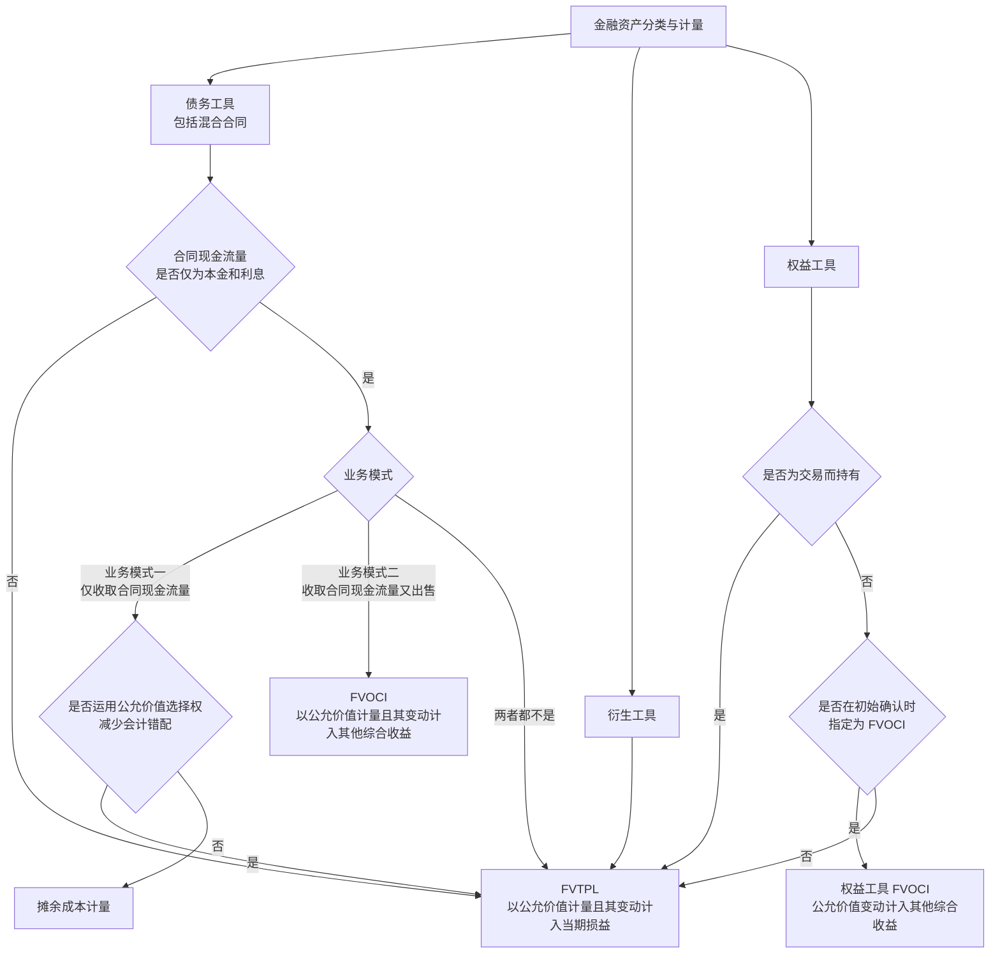
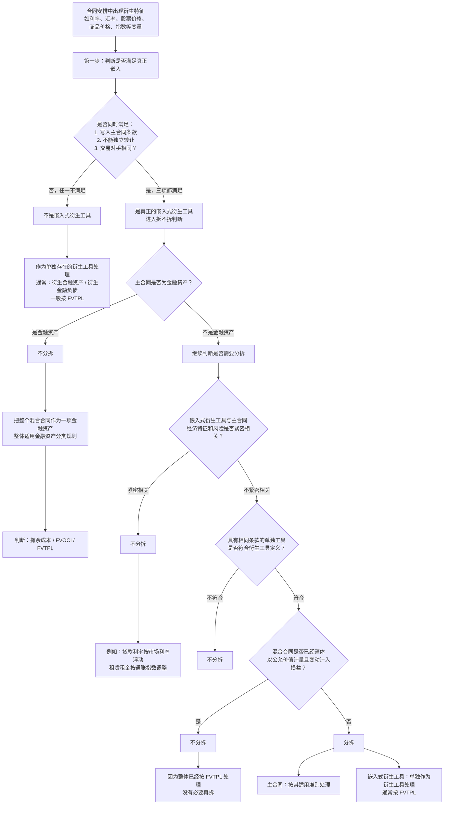

# 金融工具准则知识点

> 本文件用于整理金融工具准则的金融资产与金融负债分类、初始计量和后续计量、减值、重分类、终止确认、套期会计、权益工具投资和考试分录。

## 待整理规则

后续关于金融工具准则的问答，只有在明确要求“整理到 MD 文件”时，再追加到本文件。

新增内容优先沿用本仓库现有笔记格式：

```text
## 一、专题标题

### 核心结论

### 判断逻辑

### 易错点

### 记忆口诀
```

如涉及会计分录、表格、公式、分类判断、减值计算、利息收入、汇兑差额、其他综合收益或终止确认规则，应单独保留，避免只写结论。

## 一、金融工具准则总览

### 核心结论

金融工具准则可以先抓四条主线：

```text
1. 先识别：是不是金融资产、金融负债或权益工具；
2. 再分类：金融资产和金融负债分别归到哪一类；
3. 再计量：初始计量、后续计量、减值和利息处理；
4. 最后看特殊事项：重分类、终止确认、套期会计和列报。
```

### 判断逻辑

学习金融工具时，不要一开始就背分录，先按顺序判断：

```text
第一步：合同是否形成一方的金融资产，同时形成另一方的金融负债或权益工具；
第二步：金融资产看业务模式和合同现金流量特征；
第三步：金融负债看是否以公允价值计量且其变动计入当期损益，或按摊余成本计量；
第四步：再处理利息、减值、公允价值变动、处置和终止确认。
```

### 后续待补充专题

```text
金融资产三分类；
SPPI 测试；
摊余成本和实际利率法；
以公允价值计量且其变动计入其他综合收益；
以公允价值计量且其变动计入当期损益；
金融负债分类和自身信用风险；
金融工具减值三阶段模型；
金融资产重分类；
金融资产终止确认；
权益工具与金融负债的区分；
套期会计。
```

### 记忆口诀

```text
先识别，再分类；
先看资产负债属性，再看计量路径；
资产看模式和现金流，负债看义务和计量类。
```


## 二、金融资产分类与计量：总决策树

### 核心结论

这张图适合放在金融工具总览之后，作为金融资产分类与计量的总地图。

先按工具类型分三条线：

```text
债务工具：先做 SPPI，再看业务模式；
衍生工具：通常走 FVTPL；
权益工具：先排除交易性，再看是否指定 FVOCI。
```

### Mermaid 决策树



### 文字版判断顺序

第一，债务工具先看合同现金流量是否通过 SPPI。

```text
不通过 SPPI：直接 FVTPL；
通过 SPPI：再看业务模式。
```

第二，通过 SPPI 后，看业务模式。

```text
业务模式一：仅收取合同现金流量 -> 摊余成本；
业务模式二：既收取合同现金流量又出售 -> 债务工具 FVOCI；
两者都不是 -> FVTPL。
```

第三，即使本来可以走摊余成本，企业也可能因为会计错配而运用公允价值选择权，指定为 FVTPL。

第四，衍生工具通常直接走 FVTPL。

第五，权益工具先看是不是交易性。

```text
为交易而持有：FVTPL；
非交易性权益工具：可以选择是否指定 FVOCI；
不指定 FVOCI：通常 FVTPL。
```

### 易错点

第一，债务工具 FVOCI 和权益工具 FVOCI 来源不同。

```text
债务工具 FVOCI：通过 SPPI + 业务模式二得出；
权益工具 FVOCI：非交易性权益工具在初始确认时指定。
```

第二，衍生工具不是先做 SPPI，而是通常直接按 FVTPL。

第三，权益工具 FVOCI 是“可以指定”，不是必须指定；而且交易性权益工具不能指定。

### 记忆口诀

```text
债务先 SPPI，再看业务模式；
衍生多进损益；
权益先排交易，再看是否指定 OCI。
```

## 三、金融资产定义：四类明细分类

### 核心结论

金融资产不只是“钱”，还包括未来能够收钱、收其他金融资产、收其他方权益工具，或者通过金融工具合同取得有利结果的权利。

可以先按四张卡片记：

```text
金融资产定义 - 明细分类一：现金、其他方权益工具、收取现金或其他金融资产的合同权利；
金融资产定义 - 明细分类二：潜在有利条件下交换金融资产或金融负债的合同权利；
金融资产定义 - 明细分类三：非衍生合同下，将收到可变数量自身权益工具；
金融资产定义 - 明细分类四：衍生合同下，用自身权益工具结算，但不满足固定换固定。
```

### 金融资产定义 - 明细分类一：现金、其他方权益工具、收款合同权利

这一类最基础。

```text
现金：本身就是金融资产；
其他方权益工具：比如持有其他公司的股票；
收取现金或其他金融资产的合同权利：比如应收账款、应收票据、债权投资。
```

要注意，预付账款通常不是金融资产。

```text
预付账款未来收到的是商品或服务；
不是收取现金或其他金融资产的合同权利；
所以不属于金融资产。
```

### 金融资产定义 - 明细分类二：潜在有利条件下交换金融工具的合同权利

这一类的核心是：企业持有一项合同权利，未来如果条件有利，可以通过交换金融资产或金融负债取得好处。

典型例子是买入期权。

```text
甲公司支付 5 万元期权费，取得一项看涨期权；
6 个月后，甲公司可以按 100 万元购买乙公司股票；
如果到期时乙公司股票市价高于 100 万元，甲公司可以行权；
如果市价低于 100 万元，甲公司可以不行权。
```

期权是否属于金融资产，不取决于预计是否行权，而取决于甲公司是否拥有这项合同权利。

```text
买期权：权利在手，潜在有利，通常是金融资产；
卖期权：义务在身，潜在不利，通常是金融负债。
```

初始取得期权时：

```text
借：衍生金融资产 / 交易性金融资产 5
    贷：银行存款 5
```

期末该期权公允价值上升至 8 万元：

```text
借：衍生金融资产 / 交易性金融资产 3
    贷：公允价值变动损益 3
```

到期行权，支付 100 万元取得乙公司股票，假设期权账面价值为 8 万元：

```text
借：交易性金融资产 / 其他权益工具投资 108
    贷：银行存款 100
        衍生金融资产 / 交易性金融资产 8
```

如果到期期权未行权并失效，假设期权账面价值为 8 万元：

```text
借：公允价值变动损益 8
    贷：衍生金融资产 / 交易性金融资产 8
```

### 金融资产定义 - 明细分类三：非衍生合同下收到可变数量自身权益工具

这一类非常容易绕，核心只抓一句：

```text
第三点只讨论企业未来收到自身权益工具，而且收到数量是可变的。
```

例子：

```text
甲公司支付 100 万元；
合同约定 6 个月后，甲公司将收到价值 100 万元的甲公司自身普通股；
收到股数按结算日甲公司股票价格确定。
```

如果结算日股价为 10 元，甲公司收到 10 万股；如果股价为 20 元，甲公司收到 5 万股。收到股数会变，本质上不是普通权益交易，而是一项金融资产。

取得合同权利并支付款项时：

```text
借：交易性金融资产 100
    贷：银行存款 100
```

期末该合同公允价值上升至 108 万元：

```text
借：交易性金融资产 8
    贷：公允价值变动损益 8
```

结算日收到自身普通股，假设合同金融资产账面价值为 108 万元：

```text
借：库存股 108
    贷：交易性金融资产 108
```

注意，真正收到自身股票后，企业持有的是库存股，不再作为金融资产列示。

反向情况也要区分：

```text
未来收可变数量自身权益工具：金融资产；
未来交可变数量自身权益工具：通常是金融负债。
```

### 金融资产定义 - 明细分类四：自身权益工具结算的衍生合同，但不满足固定换固定

第四点和第三点最大的区别是：

```text
第三点：非衍生合同，只讲收到可变数量自身权益工具；
第四点：衍生工具合同，既可能收到自身权益工具，也可能交付自身权益工具。
```

第四点的核心判断是“固定换固定”：

```text
固定金额现金或其他金融资产，换固定数量自身权益工具：通常作为权益工具；
只要不是固定换固定：通常作为金融资产或金融负债。
```

如果不满足固定换固定，还要看这项衍生工具在计量日对企业是有利还是不利：

```text
正公允价值：金融资产；
负公允价值：金融负债。
```

例子：

```text
甲公司签订一项以自身股票结算的衍生合同；
该合同不满足固定金额换固定数量自身股票；
期末该合同对甲公司的公允价值为正 20 万元。
```

期末确认金融资产：

```text
借：衍生金融资产 20
    贷：公允价值变动损益 20
```

以后该合同公允价值变为负 15 万元，说明从有利头寸转为不利头寸：

```text
借：公允价值变动损益 35
    贷：衍生金融资产 20
        衍生金融负债 15
```

如果合同最终以交付自身股票结算，结算时再冲销相关衍生金融资产或衍生金融负债，并按实际结算安排处理所有者权益。考试阶段先抓住判断口径：

```text
固定换固定：权益工具；
不是固定换固定：衍生金融工具；
正值是资产，负值是负债。
```

### 衍生金融工具的科目表达

衍生金融工具在分录中既可能看到专门科目，也可能看到交易性金融资产或交易性金融负债。

更标准的表达可以写：

```text
衍生金融资产；
衍生金融负债；
衍生工具。
```

但从金融工具分类结果看，大多数衍生工具通常属于：

```text
以公允价值计量且其变动计入当期损益的金融资产或金融负债；
也就是常说的交易性金融资产或交易性金融负债。
```

所以考试写分录时，如果题目没有指定科目，可以优先写：

```text
借：衍生金融资产
    贷：公允价值变动损益

借：公允价值变动损益
    贷：衍生金融负债
```

理解上要知道：

```text
科目表达：衍生金融资产 / 衍生金融负债；
分类属性：通常属于交易性金融资产 / 交易性金融负债；
损益逻辑：公允价值变动通常计入当期损益。
```

### 易错点

第一，期权是否属于金融资产，不看预计会不会行权，而看企业是否持有合同权利。预计不会行权只会影响期权公允价值，不改变金融资产身份。

第二，第三点只限于企业未来收到可变数量自身权益工具。这个点不能扩大成所有自身权益工具结算。

第三，第四点是衍生工具合同，既可能收也可能交；不满足固定换固定时，正公允价值确认为金融资产，负公允价值确认为金融负债。

### 记忆口诀

```text
一看现金和收款权；
二看期权等有利交换权；
三看非衍生，收可变自身股；
四看衍生，固定换固定。

第三点：只看收可变股；
第四点：正值资产，负值负债。
```

## 四、金融负债定义：应付职工薪酬不是金融负债

### 核心结论

应付职工薪酬虽然将来通常要支付现金，但在金融工具准则口径下，一般不作为金融负债。

关键原因是：

```text
金融负债不是“凡是以后要付钱的负债”；
金融负债强调来源于金融工具合同，并属于金融工具准则规范范围。
```

应付职工薪酬的来源是职工提供劳动服务，适用职工薪酬准则，而不是金融工具准则。

### 判断逻辑

金融工具合同的基本特征是：

```text
一方形成金融资产；
另一方形成金融负债或权益工具。
```

例如借款合同中，银行交付现金，企业承担还本付息义务。银行形成金融资产，企业形成金融负债。

但职工薪酬关系中，企业确认的是因职工服务形成的薪酬义务：

```text
职工提供劳动服务；
企业形成支付工资、奖金、福利等义务。
```

这类义务虽然可能以现金结算，但业务性质是职工薪酬负债，不是金融工具准则下的金融负债。

### 例子理解

例如，甲公司按年度奖金计划计提应付职工薪酬 30 万元：

```text
借：管理费用 / 生产成本等 30
    贷：应付职工薪酬 30
```

这笔负债以后可能通过现金支付，但仍属于职工薪酬准则规范的负债。

再对比金融负债：甲公司向证券公司借入丙上市公司股票并对外出售，未来需要归还该上市公司股票。丙上市公司股票对持有方属于金融资产，因此甲公司承担的是交付其他方权益工具的义务，通常属于金融负债。

### 题型辨析

判断“是否属于金融负债”时，不要只看是否未来付现金，而要看这项义务的来源和准则归属。

```text
产品质量保证金：通常是预计负债，不是金融负债；
应付职工薪酬：职工薪酬负债，不是金融负债；
预收货款：未来交商品或服务，不是金融负债；
借入其他方股票后需要归还：通常是金融负债。
```

### 易错点

第一，金融负债不是“所有现金支付义务”的总称。

第二，应付职工薪酬是负债，但通常不属于金融工具准则下的金融负债。

第三，金融负债判断要抓准则归属：如果已经由职工薪酬、收入、或有事项等准则规范，通常不要机械套入金融工具准则。

### 记忆口诀

```text
以后付钱，不一定是金融负债；
金融负债看金融工具合同；
职工给服务，企业欠薪酬；
走职工薪酬准则，不走金融负债。
```

## 五、权益工具与金融负债区分：两道门

### 核心结论

发行方判断一项工具是权益工具还是金融负债，可以先记成两道门：

```text
第一道：现金门
能不能无条件避免交付现金或其他金融资产？

第二道：自身权益工具门
如果用自己的股票结算，是不是固定换固定？
```

一般可以这样记：

```text
两道都通过，才是权益工具；
有一道没通过，通常就是金融负债。
```

### 第一道：现金门

第一道看发行方是否存在不可避免的现金或其他金融资产交付义务。

如果合同要求企业强制付息、强制赎回，或者其他情况下企业不能无条件避免交付现金或其他金融资产，通常属于金融负债。

如果分红或股息完全由企业有权机构决定，企业可以无条件避免支付现金，则现金门通过。

注意：

```text
经济压力 ≠ 合同义务。
```

例如，不发优先股股息会导致普通股不能分红，或者可能影响普通股价格，这些通常只是经济后果，不等于企业有合同义务必须支付现金。

### 第二道：自身权益工具门

如果合同将来以企业自身权益工具结算，还要继续判断是否满足固定换固定。

固定换固定的意思是：

```text
固定金额的现金或金融资产
换取固定数量的企业自身权益工具。
```

如果未来交付的自身股票数量固定，通常更接近权益工具。

如果未来交付的自身股票数量会随股价、业绩、指数或其他变量变化，企业承担的是交付可变数量自身权益工具的义务，通常不能作为权益工具，可能构成金融负债。

### 例子理解：签出期权满足固定换固定

签出期权或认股权证满足固定换固定的典型场景是：

```text
企业未来收取固定金额现金，
交付固定数量自身股票。
```

例如，甲公司签出一项认股权证：

```text
投资者现在支付权证价款 10 万元；
1 年后，投资者有权按每股 20 元购买甲公司普通股 10 万股；
甲公司只能交付股票，不能现金净额结算；
行权价格固定为每股 20 元；
交付股票数量固定为 10 万股。
```

到期如果投资者行权：

```text
甲公司收现金 = 20 × 10 万股 = 200 万元；
甲公司交付自身股票 = 10 万股。
```

这就是固定金额现金换固定数量自身股票，满足固定换固定，发行方通常可以把该认股权证作为权益工具。

发行认股权证收到价款时：

```text
借：银行存款 10
    贷：其他权益工具 / 资本公积 10
```

投资者行权时，假设股票面值 1 元：

```text
借：银行存款 200
借：其他权益工具 / 资本公积 10
    贷：股本 10
        资本公积--股本溢价 200
```

如果合同改成按行权日股价折算交付股数，或者企业可以选择现金净额结算，就不再是纯粹的固定换固定。

### 例子理解：优先股强制转股

甲公司发行优先股，无期限、无赎回机制，股息是否发放由董事会和股东会批准，但 10 年后强制转换为普通股。

第一步看现金门：

```text
股息不是强制支付；
不发股息只是限制普通股分红；
发行方可以避免现金支付。
```

所以现金门通常通过。

第二步看自身权益工具门：

```text
如果每 1 股优先股固定转换为 10 股普通股：
固定换固定，更接近权益工具。

如果按优先股面值 / 转换日普通股市价折算股数：
未来交付股数不固定，通常更接近金融负债。
```

所以这类题最关键的信息是：

```text
优先股转换为普通股的价格、数量条款。
```

### 结算选择权：多种结算方式怎么判断

如果一项衍生工具存在结算选择权，例如合同规定发行方或持有方可以选择以现金净额结算，或者以发行方股份交换现金等方式结算，判断权益工具还是金融负债 / 金融资产时，要看所有可供选择的结算方式。

核心规则是：

```text
所有可选择的结算方式都表明该衍生工具应确认为权益工具，才确认为权益工具；
只要有一种结算方式会导致金融负债或金融资产，就不能作为权益工具。
```

例子一：不能作为权益工具。

```text
甲公司签出认股权证，合同允许甲公司到期选择：
1. 收取固定行权价，交付固定数量自身股票；
2. 以现金净额结算。
```

虽然第 1 种方式可能满足固定换固定，但第 2 种方式涉及现金净额结算。只要存在这条现金结算路径，甲公司就不能说自己一定能避免金融负债或金融资产属性，因此通常不能分类为权益工具。

例子二：可以作为权益工具。

```text
甲公司签出认股权证，合同允许甲公司到期选择：
1. 交付固定数量 A 类自身普通股；
2. 交付固定数量 B 类自身普通股。
```

如果两种方式本质上都只是固定数量自身权益工具结算，不涉及现金，也不涉及可变数量自身股票，则所有结算路径都符合权益工具条件，可以作为权益工具。

这类题可以这样记：

```text
结算选择权看所有出口；
所有出口都通向权益，才是权益；
有一个出口通向现金或不固定，就不是权益。
```

### 易错点

第一，不要只看名称。叫“优先股”不一定就是权益工具。

第二，不要只看是否支付现金。即使没有强制付息，也要继续看自身权益工具结算是否固定换固定。

第三，不要把经济压力当成合同义务。会影响股价、影响普通股分红，不等于企业不能无条件避免支付现金。

第四，若是衍生工具且对企业有利，也可能形成金融资产；但在发行方判断自身发行工具属于权益还是金融负债的题目中，通常按“两道门”判断。

### 记忆口诀

```text
现金能避，股数固定；
两关都过，才进权益。

现金门不过，是负债；
自身股门不过，通常也是负债。
```

## 六、权益工具与金融负债区分：子公司少数股东看跌期权

### 核心结论

母公司向子公司少数股东签出看跌期权时，要区分三张报表视角：

```text
母公司个别报表：看成签出以子公司股份为标的的期权，通常确认衍生金融负债；
子公司报表：不是子公司签约，通常不处理；
母公司合并报表：看成集团承担现金回购少数股东权益的义务，确认金融负债。
```

这类题最核心的一句话是：

```text
不是等少数股东一定行权才确认负债；
而是看集团是否已经不能无条件避免交付现金。
```

### 为什么个别报表是衍生金融负债

在母公司个别报表中，母公司签出的是一项看跌期权：

```text
标的：子公司股份；
价值：随子公司股份价格变动；
结算：未来如果少数股东行权，母公司支付现金买入子公司股份。
```

所以个别报表中，这项看跌期权符合衍生工具特征，通常按衍生金融负债或交易性金融负债处理，公允价值变动计入当期损益。

### 为什么合并报表是金融负债

在合并报表中，子公司已经纳入集团，子公司少数股东权益属于合并报表所有者权益的一部分。

```text
合并报表所有者权益
= 归属于母公司所有者权益
+ 少数股东权益
```

但看跌期权使少数股东有权要求集团用现金买回这部分权益。主动权在少数股东手里，集团不能无条件避免支付现金。

因此，合并报表中应确认金融负债，金额通常按未来回购所需支付金额的现值计量。

注意：合并层面重点不是期权公允价值，而是回购少数股东权益的现金支付义务。

### 例题和分录

甲公司持有乙公司 80% 股权，乙公司为甲公司的子公司。2×25 年 1 月 1 日，甲公司向乙公司少数股东签出一项看跌期权：如果 6 个月后乙公司股价下跌，少数股东有权要求甲公司以固定价格 1,000 万元购买其持有的乙公司 20% 股权。

假设签约日：

```text
看跌期权公允价值 = 60 万元；
6 个月后应支付金额 1,000 万元的现值 = 950 万元。
```

#### 1. 甲公司个别报表

签出期权时，按期权公允价值确认衍生金融负债：

```text
借：公允价值变动损益 60
    贷：衍生金融负债 / 交易性金融负债 60
```

如果期权初始公允价值为 0，初始可不作分录；后续公允价值变动再确认损益。

6 个月后，若行权前该期权公允价值变为 100 万元，补确认公允价值变动：

```text
借：公允价值变动损益 40
    贷：衍生金融负债 / 交易性金融负债 40
```

行权时，甲公司支付 1,000 万元购买乙公司剩余 20% 股权，形成追加长期股权投资：

```text
借：长期股权投资 1,000
    贷：银行存款 1,000
```

同时终止确认相关衍生金融负债。考试如果不专门考个别报表期权结算细节，重点抓：个别报表确认衍生金融负债，并按公允价值变动计入损益。

#### 2. 乙公司报表

乙公司不是该看跌期权合同的签约方，没有取得权利，也没有承担义务。

```text
乙公司不作会计处理。
```

#### 3. 甲公司合并报表

合并报表中，集团承担了未来可能以现金回购少数股东权益的义务。签约日按回购金额现值确认金融负债：

```text
借：少数股东权益 / 资本公积等权益项目 950
    贷：金融负债 950
```

随着时间推移，现值由 950 万元增加到 1,000 万元，确认利息影响：

```text
借：财务费用 50
    贷：金融负债 50
```

实际行权支付时：

```text
借：金融负债 1,000
    贷：银行存款 1,000
```

行权后，甲公司取得剩余 20% 股权，属于购买子公司少数股权的权益性交易，合并报表中一般不确认新的商誉或损益，差额调整资本公积等权益项目。

### 三张报表对比

| 报表层面 | 看待对象 | 会计处理 | 金额基础 |
| --- | --- | --- | --- |
| 甲公司个别报表 | 签出的看跌期权 | 衍生金融负债 / 交易性金融负债 | 期权公允价值 |
| 乙公司报表 | 不是乙公司签约 | 不处理 | 无 |
| 甲公司合并报表 | 回购少数股东权益的现金义务 | 金融负债 | 回购金额现值 |

### 易错点

第一，少数股东权益本来是合并报表所有者权益的一部分；但如果少数股东有权要求集团现金回购，相关权益会触发金融负债判断。

第二，不是等未来确定行权才确认金融负债。只要合同使企业不能无条件避免交付现金，就要确认相关金融负债。

第三，个别报表和合并报表金额基础不同：个别报表看期权公允价值，合并报表看回购金额现值。

### 记忆口诀

```text
个别报表看期权，按公允价值；
子公司没签约，不处理；
合并报表看回购义务，按支付金额现值。

不是看会不会真的回购，
而是看企业还能不能单方面拒绝付钱。
```

## 七、金融资产分类：SPPI 中的正常利息与杠杆效应

### 核心结论

SPPI（Solely Payments of Principal and Interest）判断的重点，不是看合同里有没有“利息”两个字，而是看这项利息是不是基本借贷安排下的正常利息。

正常利息通常可以补偿：

```text
货币时间价值；
信用风险；
流动性风险；
管理成本；
合理利润。
```

如果利息条款把某个风险或变量放大，或者和股票价格、商品价格、企业利润等非基本借贷风险挂钩，就可能不符合 SPPI。

通胀指数挂钩要单独理解：

```text
如果债券本金和利息与该金融资产计价货币的通胀指数挂钩，
通常可以理解为对货币时间价值的调整，
目的是补偿通胀对货币购买力的侵蚀，
一般不当然破坏 SPPI。
```

但如果挂钩的是非计价货币通胀指数，或者商品价格指数、权益指数等非基本借贷风险变量，就要谨慎判断，可能不符合 SPPI。

### 判断逻辑

第一，要用金融资产的计价货币来评估合同现金流量特征。

```text
人民币计价的金融资产，用人民币利率环境判断；
美元计价的金融资产，用美元利率环境判断。
```

不要拿错货币环境去判断现金流量是不是本金和正常利息。

第二，有完全追索权、有抵押物或有担保，通常不影响 SPPI 判断。

```text
追索权、抵押、担保：主要影响信用风险；
不改变合同现金流量本身是否为本金和正常利息。
```

所以，有担保贷款并不会因为有抵押物就不符合 SPPI。

第三，利率基准从“贷款基准利率”调整为“贷款市场报价利率”，本身不会导致不符合 SPPI。

这种调整只是把一个正常市场利率基准换成另一个正常市场利率基准，仍然可能是基本借贷安排。


### 卡片：利息构成要素看补偿性质

判断 SPPI 时，不能只看合同里写了“利息”，也不能只看利息金额大小，而要看这笔利息是在补偿什么。

正常利息补偿的是基本借贷安排中的风险和成本：

```text
货币时间价值；
信用风险；
流动性风险；
管理成本；
合理利润。
```

如果利息和非基本借贷风险或成本的变量挂钩，就不符合 SPPI。

常见不符合的情形包括：

```text
利息和权益工具价值挂钩；
利息和商品价格挂钩；
利息和碳价格指数等市场变量挂钩；
合同现金流量代表债务人收入或利润的一部分。
```

例如，贷款合同约定利率与碳价格指数挂钩。碳价格指数不是货币时间价值、信用风险、流动性风险、管理成本或合理利润的补偿，而是商品或市场价格变量，所以不符合 SPPI。

再比如，合同约定除偿还本金外，借款人还要把净利润的 5% 支付给贷款人。这时贷款人不是单纯取得正常借贷利息，而是参与了债务人的经营成果，也不符合 SPPI。

一句话记：

```text
利息补偿借贷风险和成本，可以；
利息挂钩商品价格、权益价值、收入利润，不行。
```


### 卡片：或有特征引起的现金流量变动

或有特征可以理解为：未来发生某件事时，合同现金流量会发生变化。

例如：

```text
信用评级下降，贷款利率上调；
达到 ESG 或碳减排目标，贷款利率下调；
销售额达到某个水平，贷款利率变化。
```

判断这类条款是否符合 SPPI，核心看两步。

第一步，看或有事项是否和基本借贷风险及成本直接相关。

如果或有事项与基本借贷风险和成本直接相关，而且现金流量变化方向一致，通常仍然符合基本借贷安排。

例如：

```text
借款人信用评级下降；
信用风险上升；
贷款利率上调。
```

这属于风险变高、补偿变高，方向一致，通常可以通过 SPPI。

第二步，如果或有事项和基本借贷风险及成本不直接相关，就要看现金流量差异是否显著。

如果在所有可能的合同情形下，含有该或有特征的现金流量，与不含该特征的普通借贷现金流量不存在显著差异，仍然可能通过 SPPI。

### 例子：碳减排目标小幅降息

例如，贷款合同约定：

```text
贷款利率为 3%；
如果债务人当年达到碳减排目标，贷款利率下调至 2.9%。
```

这里“是否达到碳减排目标”属于或有事项，不是“碳价格指数”变量。它没有直接把利息和商品价格或碳价格风险挂钩。

如果 3% 和 2.9% 的现金流量差异不显著，可以认为合同现金流量仍然只是本金和以未偿付本金金额为基础的利息支付，能够通过 SPPI。

但如果合同写成：

```text
贷款利率随碳价格指数变动；
或者贷款利率直接挂钩商品价格、权益工具价值。
```

这就不是简单的或有激励，而是引入了非基本借贷风险，通常不符合 SPPI。

一句话记：

```text
风险变，利率跟着合理变，通常可以；
非借贷事项小幅激励，看差异是否显著；
直接挂钩商品价格、权益价值，通常不行。
```

### 例子理解

利率为“贷款市场报价利率 + 100 基点”的贷款，通常符合 SPPI。

```text
LPR + 100 基点
= LPR + 1%
```

这个 1% 可以理解为信用风险、流动性风险、管理成本和合理利润等补偿，仍然是正常借贷利息。

但利率为“贷款市场报价利率向上浮动 10%”的贷款，不符合 SPPI。

```text
LPR 向上浮动 10%
= LPR × 1.10
```

这里不是简单加一个固定点差，而是把基准利率的变动按比例放大。基准利率越高，额外上浮金额也越大，存在杠杆效应。

例如：

```text
如果 LPR = 4%，LPR × 1.10 = 4.4%；
如果 LPR = 5%，LPR × 1.10 = 5.5%。
```

实际利率的变化被基准利率变化带着放大，不再只是基本借贷安排下的正常利息。

### 易错点

不要把“加点”和“上浮比例”混在一起。

```text
LPR + 固定点差：通常是正常利息补偿；
LPR × 固定倍数：可能产生杠杆效应。
```

也不要认为有抵押、有担保、有追索权就会破坏 SPPI。它们通常只是降低信用风险，不改变合同现金流量特征。

### 记忆口诀

```text
SPPI 看现金流，
只要本金和正常息；
加点通常没问题，
乘倍数要防杠杆。
```

## 八、金融资产分类：应收款项融资与 FVOCI

### 核心结论

“应收款项融资”是报表列报项目，不是金融资产分类名称。

实务中，它通常对应的是以公允价值计量且其变动计入其他综合收益的债务工具金融资产，也就是 FVOCI。

可以这样理解：

```text
应收票据 / 应收账款
如果满足 FVOCI 债务工具分类条件，
报表上通常列示为“应收款项融资”。
```

### 判断逻辑

应收票据或应收账款不是随便“转到”应收款项融资，而是因为其金融资产分类和业务模式不同。

通常需要同时满足两点：

```text
1. 业务模式：既以收取合同现金流量为目标，又以出售金融资产为目标；
2. 合同现金流量特征：符合 SPPI。
```

如果只是持有到期收款，通常是摊余成本计量，列示为应收账款或应收票据。

如果既可能收款，也可能背书、贴现、转让，并且现金流量符合 SPPI，则可能分类为 FVOCI，列示为应收款项融资。

### 例子理解

最常见的是银行承兑汇票。

```text
企业持有银行承兑汇票；
一方面可能持有到期向银行收款；
另一方面也可能背书转让或贴现。
```

这种业务模式通常不是单纯“持有收款”，而是：

```text
收取合同现金流量 + 出售金融资产。
```

如果该票据现金流量符合 SPPI，就可以分类为 FVOCI，并在报表中列示为应收款项融资。

### 易错点

第一，应收款项融资不是“应收账款换个名字”。它背后通常对应 FVOCI 债务工具分类。

第二，应收账款和应收票据都可能成为应收款项融资的来源，但实务中更常见的是银行承兑汇票。

第三，不是所有票据都一定列入应收款项融资。关键仍然看业务模式和 SPPI。

```text
普通应收账款：通常持有收款 -> 摊余成本 -> 应收账款；
银行承兑汇票等：收款 + 背书/贴现/转让 -> FVOCI -> 应收款项融资。
```

### 记忆口诀

```text
应收款项融资看分类，
不是简单改名字；
收款加出售，且通过 SPPI，
通常才进 FVOCI。
```

## 九、权益工具 FVOCI：合伙企业份额通常不能直接指定

### 核心结论

FVOCI 是“以公允价值计量且其变动计入其他综合收益”，不是 FVTOCI。

非交易性权益工具投资可以在初始确认时指定为 FVOCI，但“合伙企业份额”通常不能简单当作普通权益工具投资。

考试中遇到有限合伙份额、普通合伙份额、基金份额、理财份额，通常要谨慎，不要直接指定为 FVOCI。

### 判断逻辑

金融工具准则里的权益工具，不是泛泛说“权益性投资”，而是指能够证明持有人拥有发行方扣除所有负债后剩余权益的合同。

普通公司股票最典型。

但合伙企业份额通常更复杂，可能存在：

```text
合伙期限有限；
到期清算或退伙时取得现金或净资产；
收益分配、退出、赎回安排由合伙协议约定；
持有人更像拥有一项按协议取得现金或其他金融资产的权利。
```

因此，不能因为它叫“合伙份额”，就直接认为它是可以指定为 FVOCI 的普通权益工具投资。

### 例子理解

甲公司以 600 万元认购某有限合伙企业 10% 的份额，合伙期限 5 年。

这类合伙企业份额不是上市公司普通股，也不当然满足权益工具定义。题目给出“合伙期限 5 年”“有限合伙人”等信息，通常是在提示它不是普通权益工具投资。

所以通常不能指定为 FVOCI，而应分类为：

```text
以公允价值计量且其变动计入当期损益的金融资产；
即 FVTPL。
```

### 易错点

第一，能否指定 FVOCI，不看是普通合伙人还是有限合伙人，而看该份额是否真正符合权益工具投资定义。

第二，发行方在特殊条件下列为权益，不代表投资方就能把该投资指定为 FVOCI。

第三，合伙企业份额、基金份额、理财份额，考试里通常不要直接当作普通权益工具投资。

### 记忆口诀

```text
普通股票，可看权益；
合伙基金，先别指定；
期限退出拿现金，
通常走 FVTPL。
```

## 十、嵌入式衍生工具-概念和主合同

### 核心结论

嵌入式衍生工具可以先用一句话理解：

```text
一个普通合同里，藏了一个会让现金流量跟随某个变量变化的小衍生工具。
```

它不是单独签订的一份期权、远期或互换合同，而是嵌在一个主合同里。

以后本文件中与嵌入式衍生工具有关的内容，标题统一使用：

```text
嵌入式衍生工具-具体内容
```

### 判断逻辑

嵌入式衍生工具所在的合同，通常叫混合合同。

```text
混合合同 = 主合同 + 嵌入式衍生工具
```

主合同是外壳，可能是：

```text
租赁合同；
保险合同；
服务合同；
特许权合同；
债务工具合同；
含嵌入条款的贷款合同。
```

嵌入式衍生工具是藏在主合同里的特殊条款，它会让合同现金流量随着某个变量变化。

常见变量包括：

```text
利率；
汇率；
商品价格；
股票价格；
价格指数；
信用等级；
其他指数。
```

### 例子理解

例子一：租赁合同中租金按物价指数调整。

```text
主合同：3 年租赁合同；
嵌入式衍生工具：租金按一般物价指数调整的条款。
```

例子二：债券利息和股票指数挂钩。

```text
主合同：债券合同；
嵌入式衍生工具：利息随股票指数变化的条款。
```

例子三：贷款利息和黄金价格变化挂钩。

```text
主合同：贷款合同；
嵌入式衍生工具：利息随黄金价格变化的条款。
```

这些条款的共同点是：表面上是一个普通合同，但合同现金流量被某个外部变量带着变化。

### 和独立衍生工具的区别

嵌入式衍生工具必须真的嵌在主合同里，不能独立转让。

如果某项衍生工具虽然和金融工具有关，但它可以独立转让，或者交易对手方和主合同不同，就不是嵌入式衍生工具，而是独立存在的衍生工具。

例如：

```text
贷款合同旁边另签一份利率互换；
如果该利率互换可以单独转让，或交易对手方不同，
它就是独立衍生工具，不是嵌入式衍生工具。
```

### 易错点

第一，不是所有“变量条款”都一定要分拆。现在这一步只是理解概念，后面还要继续判断是否需要从主合同中分拆出来单独核算。

第二，嵌入式衍生工具不是单独存在的合同，而是混合合同中的一部分。能单独转让的衍生工具，通常不是嵌入式衍生工具。

第三，嵌入式衍生工具的难点不在“有没有变量”，而在后续判断：

```text
要不要分拆；
如果要分拆，怎么单独计量；
如果不能分拆，整个混合合同怎么分类。
```

### 嵌入式衍生工具-判断流程图

这张图先解决两个问题：

```text
第一层：它到底是不是真正嵌入式衍生工具；
第二层：如果是真正嵌入式衍生工具，要不要从主合同中分拆。
```




如果本地 Markdown 编辑器不渲染流程图，就按下面这条文字链判断：

```text
真嵌入 = 写进合同 + 不能单转 + 同一对手；
少一个条件，就不是嵌入式衍生工具，而是单独衍生工具。

真嵌入以后：
主合同是金融资产，整体分类，不分拆；
主合同不是金融资产，才看紧密相关；
不紧密、像衍生、整体未 FVTPL，才分拆。
```

### 记忆口诀

```text
普通合同是外壳，
变量条款藏其中；
跟随指数价格变，
就是嵌入式衍生。

能拆出去单独卖，
就不是嵌入式。
```
